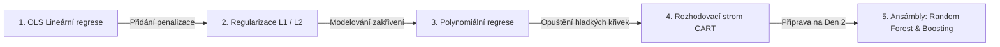

# Rekapitulace Dne 1: Komplexní průvodce regresními modely v Machine Learningu

> **Podklad kurzu:** `Day_1_summary.pdf` (Coders Lab: Machine Learning – Day 1 Summary)  
> **Doplněno o:** Srovnávací analýzu všech algoritmů, benchmarky z reálných databází (King County & Diamanty), interaktivní syntézu, srovnávací tabulku a přípravu na kvíz.

---

## 1. Co jsme se v 1. dni naučili?

V prvním dni kurzu jsme položili pevné základy **učení s učitelem (Supervised Learning)** se zaměřením na **regresi**.  
Regresní úloha spočívá v predikci **spojité číselné proměnné** (cena nemovitosti, hodnota diamantu, mzda, teplota, obrat firmy) na základě množiny nezávislých příznaků (vlastností).

Prošli jsme kompletní evoluci od nejjednoduššího lineárního vztahu až po neparametrické nelineární modely:



---

## 2. Podrobné srovnání regresních architektur

| Model / Technika | Princip fungování | Tvar predikční funkce | Klíčové hyperparametry | Citlivost na měřítko (Scaling) | Odolnost vůči odlehlým hodnotám (Outliers) | Interpretovatelnost |
| :--- | :--- | :--- | :--- | :---: | :---: | :---: |
| **OLS Lineární regrese** | Minimalizace součtu čtverců chyb (RSS / OLS) | Globální přímka / nadrovina: $y = \beta_0 + \sum \beta_i x_i$ | Žádné (analytické řešení $\mathbf{(X^T X)^{-1} X^T y}$) | Nízká pro predikci, nutná pro porovnání koeficientů | ❌ Velmi nízká (kvadrát chyby přitahuje přímku k extrémům) | 🟢 **Maximální** (koeficient = mezní přínos) |
| **Lasso regrese (L1)** | OLS + penalizace součtu absolutních hodnot: $\alpha \sum |\beta_j|$ | Globální nadrovina s vynulovanými koeficienty | $\alpha$ (síla penalizace) | ⚠️ **Kritická** (bez StandardScaleru penalizuje nespravedlivě) | ❌ Nízká | 🟢 **Vysoká + Feature Selection** |
| **Ridge regrese (L2)** | OLS + penalizace součtu čtverců vah: $\alpha \sum \beta_j^2$ | Globální nadrovina se scvrklými koeficienty | $\alpha$ (síla penalizace) | ⚠️ **Kritická** (nutné škálovat před trénováním) | ❌ Nízká | 🟢 **Vysoká** (řeší multikolinearitu) |
| **Elastic Net** | Lineární kombinace L1 a L2 penalizace | Globální nadrovina kombinující výběr a scvrkávání | $\alpha$, `l1_ratio` | ⚠️ **Kritická** | ❌ Nízká | 🟢 **Vysoká** |
| **Polynomiální regrese** | Expanze příznaků do vyšších mocnin ($x^2, x^3, x_1 x_2$) + regrese | Hladká křivka / vlnitá plocha vyššího řádu | Stupeň polynomu `degree`, penalizace $\alpha$ | ⚠️ **Extrémní** (mocniny explodují do obřích čísel) | ❌ **Katastrofální** (extrémy na okrajích vystřelí do nekonečna) | 🟡 **Nízká** (stovky interakčních členů) |
| **Rozhodovací strom (CART)** | Rekurzivní binární dělení prostoru pravoúhlými řezy | Po částech konstantní (schodovitá funkce / plošiny) | `max_depth`, `min_samples_leaf`, `min_samples_split` | 🟢 **Nulová** (strom zajímá pouze pořadí hodnot) | 🟢 **Vysoká** (extrém pouze posune práh do izolovaného listu) | 🟢 **Vysoká při malé hloubce** / ❌ Nízká při 30 patrech |

---

## 3. Ilustrativní příklad: Jeden problém, 4 různé pohledy modelů

Představme si jednoduchou modelovou situaci: **Závislost ceny auta na jeho stáří**.

```
Cena
  ^
  |  *  *                                 [Nové auto: prudký pád ceny v prvních 2 letech]
  |        *   *                          [Střední věk: stabilní pomalý pokles]
  |               *   *   *               [Veterán / Sběratelský kus (25+ let): cena začíná růst!]
  |                           *      *
  +-------------------------------------> Stáří auta (roky)
```

Jak se s tímto reálným jevem vypořádají naše modely?

1. **Lineární regrese (OLS):**
   - Proloží data jednou klesající přímkou.
   - *Selhání:* U nového auta podhodnotí rychlost ztráty hodnoty. U veterána tvrdošíjně předpoví zápornou cenu (auto byste museli s doplatkem vyhodit).
2. **Polynomiální regrese (stupeň 2 a 3):**
   - Vytvoří elegantní parabolu: nejprve strmý pokles, pak dno a u veteránů se křivka stočí nahoru.
   - *Riziko:* Pokud zadáte auto staré 40 let, křivka může vystřelit strmě do vesmíru a předpovědět cenu 50 milionů (Rungeho jev na okrajích).
3. **Regularizovaná regrese (Ridge/Lasso):**
   - Pokud bychom do polynomu zahrnuli 10 různých stupňů stáří, Lasso vynuluje nadbytečné mocniny a zkrotí divoké vlnění křivky.
4. **Rozhodovací strom:**
   - Rozseká stáří na věkové kategorie:
     - `stáří <= 2 roky` $\to$ průměrná cena 800 000 Kč
     - `2 < stáří <= 8 let` $\to$ průměrná cena 450 000 Kč
     - `8 < stáří <= 20 let` $\to$ průměrná cena 150 000 Kč
     - `stáří > 20 let` $\to$ průměrná cena 380 000 Kč (veteráni)
   - *Výhoda:* Skvěle zachytí skokové přechody bez nutnosti vymýšlet matematické vzorce.

---

## 4. Metriky kvality: Jak poznat vítězný model?

| Metrika | Vzorec | Význam | Kdy použít |
| :--- | :---: | :--- | :--- |
| **$R^2$ (Koeficient determinace)** | $1 - \frac{\sum (y_i - \hat{y}_i)^2}{\sum (y_i - \bar{y})^2}$ | Podíl variability cílové proměnné vysvětlený modelem ($0 \dots 1$). | Pro celkové srovnání modelů napříč různými měřítky a datasety. |
| **Adjusted $R^2$** | $1 - \frac{(1 - R^2)(n - 1)}{n - p - 1}$ | $R^2$ penalizované za počet prediktorů ($p$). | Při výběru příznaků v lineární regresi (zabraňuje umělému navyšování skóre). |
| **MAE (Mean Absolute Error)** | $\frac{1}{n} \sum \|y_i - \hat{y}_i\|$ | Průměrná absolutní odchylka v původních jednotkách (Kč, USD). | Robustní vůči odlehlým hodnotám; snadno srozumitelná pro byznys zadavatele. |
| **MSE (Mean Squared Error)** | $\frac{1}{n} \sum (y_i - \hat{y}_i)^2$ | Průměrná čtvercová odchylka (ve čtvercích jednotek). | Jako optimalizační ztrátová funkce při trénování modelů. |
| **RMSE (Root Mean Squared Error)** | $\sqrt{\text{MSE}}$ | Odmocnina z MSE v původních jednotkách. | Když je velká chyba neúměrně nebezpečnější než malá (např. u drahých nemovitostí). |

---

## 5. Výsledky našich experimentů na reálných datech kurzu

V rámci celodenního praktického maratonu jsme otestovali všechny algoritmy na dvou datasetech:

### Dataset 1: Nemovitosti v King County (`kc_house_data.csv`)
- **OLS Baseline:** $R^2 \approx 0.695$, $\text{RMSE} \approx 203\,000\text{ USD}$
- **Ridge / Lasso (s normalizací):** $R^2 \approx 0.698$, stabilizace vah, eliminace multikolinearity
- **Neomezený strom (Default):** Train $R^2 = 1.000$, Test $R^2 = 0.705$, $\text{RMSE} \approx 211\,000\text{ USD}$ (35 pater, 16 683 listů – drastické přeučení!)
- **Optimální prořezaný strom (GridSearchCV):** Test $R^2 = 0.793$, $\text{RMSE} \approx 176\,800\text{ USD}$ (**pokles chyby o 35 000 USD** díky ohraničení bohatých enkláv pomocí souřadnic `lat` a `long`).

### Dataset 2: Ceny diamantů (`diamonds.csv`)
- **OLS Baseline (Cvičení 2):** $R^2 \approx 0.88 - 0.92$, $\text{RMSE} \approx 1\,150 - 1\,400\text{ USD}$
- **Polynom 3. stupně (Cvičení 7):** $R^2 \approx 0.955$, $\text{RMSE} \approx 850\text{ USD}$
- **Rozhodovací strom (Optimální, Cvičení 9):** $R^2 = 0.9787$, $\text{RMSE} = 584.0\text{ USD}$ (**drastické snížení chyby téměř na polovinu** díky schopnosti zachytit skokové psychologické přirážky u kulatých karátů `carat >= 1.00`).

---

## 6. Příprava na Kvíz (Checklist klíčových znalostí)

Před spuštěním závěrečného testu si ověřte následující koncepty:

- [x] **Rozdíl mezi L1 a L2:** Lasso (L1) dělá výběr příznaků nulováním vah; Ridge (L2) váhy pouze scvrkává k nule, ale žádnou úplně nevyřadí.
- [x] **Proč škálovat před regularizací:** Bez `StandardScaler` by proměnná s velkými čísly (např. rozloha v mm²) byla penalizována jinak než proměnná v malých číslech (počet koupelen).
- [x] **Co způsobuje vysoký stupeň polynomu:** Přeučení (overfitting) a Rungeho jev – divoké oscilace na okrajích dat.
- [x] **Jak strom počítá predikci:** V listovém uzlu spočte aritmetický průměr hodnot všech trénovacích vzorků, které do něj spadly.
- [x] **Proč strom nepotřebuje škálování:** Dělení se provádí porovnáním $x_j \le s$, což je invariantní vůči monotónním transformacím.
- [x] **Co dělá `min_samples_leaf`:** Zabraňuje stromu tvořit listy s 1 nebo 2 vzorky, čímž zásadně omezuje přetrénování.
