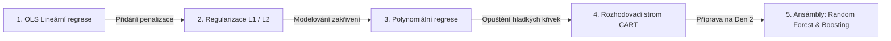

# Rekapitulace Dne 1: Komplexní průvodce regresními modely v Machine Learningu

> **Podklad kurzu:** `Day_1_summary.pdf` (Coders Lab: Machine Learning – Day 1 Summary)  
> **Doplněno o:** Srovnávací analýzu všech algoritmů, benchmarky z reálných databází (King County & Diamanty), interaktivní syntézu, srovnávací tabulku a přípravu na kvíz.

---

## 1. Co jsme se v 1. dni naučili?

V prvním dni kurzu jsme položili pevné základy **učení s učitelem (Supervised Learning)** se zaměřením na **regresi**.  
Regresní úloha spočívá v predikci **spojité číselné proměnné** (cena nemovitosti, hodnota diamantu, mzda, teplota, obrat firmy) na základě množiny nezávislých příznaků (vlastností).

Prošli jsme kompletní evoluci od nejjednoduššího lineárního vztahu až po neparametrické nelineární modely:



---

## 2. Podrobné srovnání regresních architektur

| Model / Technika | Princip fungování | Tvar predikční funkce | Klíčové hyperparametry | Citlivost na měřítko (Scaling) | Odolnost vůči odlehlým hodnotám (Outliers) | Interpretovatelnost |
| :--- | :--- | :--- | :--- | :---: | :---: | :---: |
| **OLS Lineární regrese** | Minimalizace součtu čtverců chyb (RSS / OLS) | Globální přímka / nadrovina: $y = \beta_0 + \sum \beta_i x_i$ | Žádné (analytické řešení $\mathbf{(X^T X)^{-1} X^T y}$) | Nízká pro predikci, nutná pro porovnání koeficientů | ❌ Velmi nízká (kvadrát chyby přitahuje přímku k extrémům) | 🟢 **Maximální** (koeficient = mezní přínos) |
| **Lasso regrese (L1)** | OLS + penalizace součtu absolutních hodnot: $\alpha \sum |\beta_j|$ | Globální nadrovina s vynulovanými koeficienty | $\alpha$ (síla penalizace) | ⚠️ **Kritická** (bez StandardScaleru penalizuje nespravedlivě) | ❌ Nízká | 🟢 **Vysoká + Feature Selection** |
| **Ridge regrese (L2)** | OLS + penalizace součtu čtverců vah: $\alpha \sum \beta_j^2$ | Globální nadrovina se scvrklými koeficienty | $\alpha$ (síla penalizace) | ⚠️ **Kritická** (nutné škálovat před trénováním) | ❌ Nízká | 🟢 **Vysoká** (řeší multikolinearitu) |
| **Elastic Net** | Lineární kombinace L1 a L2 penalizace | Globální nadrovina kombinující výběr a scvrkávání | $\alpha$, `l1_ratio` | ⚠️ **Kritická** | ❌ Nízká | 🟢 **Vysoká** |
| **Polynomiální regrese** | Expanze příznaků do vyšších mocnin ($x^2, x^3, x_1 x_2$) + regrese | Hladká křivka / vlnitá plocha vyššího řádu | Stupeň polynomu `degree`, penalizace $\alpha$ | ⚠️ **Extrémní** (mocniny explodují do obřích čísel) | ❌ **Katastrofální** (extrémy na okrajích vystřelí do nekonečna) | 🟡 **Nízká** (stovky interakčních členů) |
| **Rozhodovací strom (CART)** | Rekurzivní binární dělení prostoru pravoúhlými řezy | Po částech konstantní (schodovitá funkce / plošiny) | `max_depth`, `min_samples_leaf`, `min_samples_split` | 🟢 **Nulová** (strom zajímá pouze pořadí hodnot) | 🟢 **Vysoká** (extrém pouze posune práh do izolovaného listu) | 🟢 **Vysoká při malé hloubce** / ❌ Nízká při 30 patrech |

---

## 3. Ilustrativní příklad: Jeden problém, 4 různé pohledy modelů

Představme si jednoduchou modelovou situaci: **Závislost ceny auta na jeho stáří**.

```
Cena
  ^
  |  *  *                                 [Nové auto: prudký pád ceny v prvních 2 letech]
  |        *   *                          [Střední věk: stabilní pomalý pokles]
  |               *   *   *               [Veterán / Sběratelský kus (25+ let): cena začíná růst!]
  |                           *      *
  +-------------------------------------> Stáří auta (roky)
```

Jak se s tímto reálným jevem vypořádají naše modely?

1. **Lineární regrese (OLS):**
   - Proloží data jednou přímkou.
   - *Selhání:* Zcela ignoruje U-křivku dat. Hledá kompromis mezi novými auty a veterány, takže je téměř vodorovná: u nového vozu těžce podhodnotí cenu (odhadne jen ~300 tis. místo reálných 750 tis. Kč) a u veterána ji rovněž podstřelí (~225 tis. místo reálných 450 tis. Kč).
2. **Polynomiální regrese (stupeň 2 a 3):**
   - Vytvoří elegantní parabolu: nejprve strmý pokles, pak dno a u veteránů se křivka stočí nahoru.
   - *Riziko:* Pokud zadáte auto staré 40 let, křivka může vystřelit strmě do vesmíru a předpovědět cenu 50 milionů (Rungeho jev na okrajích).
3. **Regularizovaná regrese (Ridge/Lasso):**
   - Pokud bychom do polynomu zahrnuli 10 různých stupňů stáří, Lasso vynuluje nadbytečné mocniny a zkrotí divoké vlnění křivky.
4. **Rozhodovací strom:**
   - Rozseká stáří na věkové kategorie:
     - `stáří <= 2 roky` $\to$ průměrná cena 800 000 Kč
     - `2 < stáří <= 8 let` $\to$ průměrná cena 450 000 Kč
     - `8 < stáří <= 20 let` $\to$ průměrná cena 150 000 Kč
     - `stáří > 20 let` $\to$ průměrná cena 380 000 Kč (veteráni)
   - *Výhoda:* Skvěle zachytí skokové přechody bez nutnosti vymýšlet matematické vzorce.

---

## 4. Metriky kvality: Jak poznat vítězný model?

| Metrika | Vzorec | Význam | Kdy použít |
| :--- | :---: | :--- | :--- |
| **$R^2$ (Koeficient determinace)** | $1 - \frac{\sum (y_i - \hat{y}_i)^2}{\sum (y_i - \bar{y})^2}$ | Podíl variability cílové proměnné vysvětlený modelem (na train sadě $0 \dots 1$, na test sadě $R^2 \in (-\infty, 1]$). | Pro celkové srovnání modelů napříč různými měřítky a datasety. |
| **Adjusted $R^2$** | $1 - \frac{(1 - R^2)(n - 1)}{n - p - 1}$ | $R^2$ penalizované za počet prediktorů ($p$). | Při výběru příznaků v lineární regresi (zabraňuje umělému navyšování skóre). |
| **MAE (Mean Absolute Error)** | $\frac{1}{n} \sum \|y_i - \hat{y}_i\|$ | Průměrná absolutní odchylka v původních jednotkách (Kč, USD). | Robustní vůči odlehlým hodnotám; snadno srozumitelná pro byznys zadavatele. |
| **MSE (Mean Squared Error)** | $\frac{1}{n} \sum (y_i - \hat{y}_i)^2$ | Průměrná čtvercová odchylka (ve čtvercích jednotek). | Jako optimalizační ztrátová funkce při trénování modelů. |
| **RMSE (Root Mean Squared Error)** | $\sqrt{\text{MSE}}$ | Odmocnina z MSE v původních jednotkách. | Když je velká chyba neúměrně nebezpečnější než malá (např. u drahých nemovitostí). |

---

## 5. Výsledky našich experimentů na reálných datech kurzu

V rámci celodenního praktického maratonu jsme otestovali všechny algoritmy na dvou datasetech:

### Dataset 1: Nemovitosti v King County (`kc_house_data.csv`)
- **OLS Baseline:** $R^2 \approx 0.695$, $\text{RMSE} \approx 203\,000\text{ USD}$
- **Ridge / Lasso (s normalizací):** $R^2 \approx 0.698$, stabilizace vah, eliminace multikolinearity
- **Neomezený strom (Default):** Train $R^2 = 1.000$, Test $R^2 = 0.705$, $\text{RMSE} \approx 211\,000\text{ USD}$ (35 pater, 16 683 listů – drastické přeučení!)
- **Optimální prořezaný strom (GridSearchCV):** Test $R^2 = 0.793$, $\text{RMSE} \approx 176\,800\text{ USD}$ (**pokles chyby o 35 000 USD** díky ohraničení bohatých enkláv pomocí souřadnic `lat` a `long`).

### Dataset 2: Ceny diamantů (`diamonds.csv`)
- **OLS Baseline (Cvičení 2):** Test $R^2 = 0.9095$, $\text{RMSE} = 1\,172.5\text{ USD}$
- **Lasso / Ridge regularizace 4Cs (Cvičení 6):** Test $R^2 = 0.9095$, $\text{RMSE} = 1\,172.1\text{ USD}$ (Stabilizace multikolinearity)
- **Polynom 2. stupně (Cvičení 7):** Test $R^2 = 0.9655$, $\text{RMSE} = 723.7\text{ USD}$ (Optimální kvadratická expanze, 54 členů)
- **Polynom 3. stupně surový OLS (Cvičení 7):** Test $R^2 = 0.8591$, $\text{RMSE} = 1\,463.0\text{ USD}$ (Kolaps variance z multikolinearity 219 členů)
- **Polynom 3. stupně + Ridge $\alpha=100$ (Cvičení 7):** Test $R^2 = 0.9744$, $\text{RMSE} = 623.2\text{ USD}$ (Regularizace L2 zkrotila 219 členů)
- **Rozhodovací strom (Optimální z GridSearchCV, Cvičení 9):** Test $R^2 = 0.9785$, $\text{RMSE} = 587.0\text{ USD}$, $\text{MAE} = 307.3\text{ USD}$ (**drastické snížení chyby téměř na polovinu** díky schopnosti zachytit skokové psychologické přirážky u kulatých karátů `carat >= 1.00`).

---

## 6. Komplexní česko-anglický glosář klíčových pojmů (CZ / EN Dictionary)

| Český termín | Anglický termín | Kategorie | Význam a definice | Vztah k regresi & Řešení |
| :--- | :--- | :--- | :--- | :--- |
| **Přeučení (Přetrénování)** | **Overfitting** | Chování modelů | Model se naučil trénovací data „nazpaměť“ včetně šumu a na nových datech selhává ($R^2_{\text{train}} \gg R^2_{\text{test}}$). | Typické pro neomezené stromy (35 pater u reality) nebo vysoké stupně polynomu. **Řešení:** prořezání (`max_depth`, `min_samples_leaf`), regularizace L1/L2. |
| **Nedoučení** | **Underfitting** | Chování modelů | Model je příliš jednoduchý a nedokáže zachytit zákonitosti dat; má vysokou chybu na train i test sadě. | Aplikace OLS přímky na parabolická data (ceny veteránů) nebo skoky u diamantů. **Řešení:** polynom, nelineární stromy, Feature Engineering. |
| **Kompromis vychýlení a rozptylu** | **Bias-Variance Tradeoff** | Chování modelů | Celková chyba se skládá z chyby zjednodušení (Bias) a citlivosti na trénovací data (Variance). | OLS má vysoký bias a nízkou variance; hluboký strom nulový bias, ale obrovskou variance. Cílem je nalézt optimum. |
| **Regularizace** | **Regularization** | Matematika & Optimalizace | Penalizace složitosti modelu přidáním pokuty za velikost koeficientů do účelové funkce ($\text{Loss} = \text{MSE} + \text{Penalty}$). | Zabraňuje explozím vah u korelovaných nebo vysokodimenzionálních dat. |
| **L1 regularizace (Lasso)** | **L1 Regularization (Lasso)** | Regularizace | Penalizace součtu absolutních hodnot: $\alpha \sum \|\beta_j\|$. Způsobuje přesné nulování vah. | Provádí **Feature Selection** (výběr nejdůležitějších vlastností). Vyžaduje `StandardScaler`. |
| **L2 regularizace (Ridge)** | **L2 Regularization (Ridge)** | Regularizace | Penalizace součtu čtverců vah: $\alpha \sum \beta_j^2$. Scvrkává váhy k nule, ale nenuluje je úplně. | Řeší **multikolinearitu** a stabilizuje numerické výpočty. Vyžaduje `StandardScaler`. |
| **Únik informací** | **Data Leakage** | Metodologie dat | Informace z testovací sady neúmyslně proniknou do trénování (např. fitování scaleru na všech datech). | Zkresluje výsledky; model vypadá skvěle v laboratoři, ale selže v produkci. **Řešení:** vždy `train_test_split` jako první krok. |
| **Multikolinearita** | **Multicollinearity** | Příprava dat | Vysoká vzájemná korelace mezi dvěma či více prediktory (např. rozměry $x, y, z$ a váha `carat`). | Nestabilní koeficienty $\beta$ v OLS, obrovské směrodatné odchylky. Měří se přes VIF; řeší se odstraněním nebo Ridge regresi. |
| **Kletba dimenzionality** | **Curse of Dimensionality** | Příprava dat | S rostoucím počtem sloupců objem prostoru roste exponenciálně a data jsou extrémně řídká. | Polynom 3. stupně vygeneroval na 9 prediktorech 219 členů (na 26 sloupcích bez biasu 3 653 členů) a způsobil kolaps variance OLS. **Řešení:** PCA, Lasso výběr. |
| **Prořezávání stromu** | **Tree Pruning** | Rozhodovací stromy | Omezení růstu nebo odstranění větví stromu, které nezlepšují zobecnění. | Pre-pruning (`max_depth`, `min_samples_leaf`) snížil počet listů diamantů z 36 792 na 1 840 a srazil RMSE o 131 USD. |
| **Důležitost příznaků (MDI)** | **Feature Importance (MDI)** | Rozhodovací stromy | Celkový pokles nečistoty (MSE) napříč všemi uzly stromu způsobený daným prediktorem. | Rychlá identifikace byznys tahounů: u diamantů `carat` a `y` tvoří $>75\,\%$, u domů `sqft_living` a `grade`. |
| **Neschopnost extrapolace** | **Inability to Extrapolate** | Rozhodovací stromy | Strom neumí předpovědět hodnotu mimo rozsah trénovacích dat (predikce je v listu konstantním průměrem). | Pro vilu za 50 mil. USD strom předpoví maximálně 7 mil. USD (narazí na strop trénovací sady). |
| **Koeficient determinace ($R^2$)** | **$R^2$ Score** | Metriky kvality | Podíl rozptylu cílové proměnné vysvětlený modelem ($R^2 \in (-\infty, 1]$; na trénovací sadě s interceptem $0 \dots 1$). | $R^2 = 0.79$ znamená 79 % vysvětlené variability. Na trénovacích datech sledujte Adjusted $R^2$. |
| **Průměrná absolutní chyba (MAE)** | **Mean Absolute Error (MAE)** | Metriky kvality | Průměrná absolutní odchylka v reálných jednotkách: $\frac{1}{n} \sum \|y_i - \hat{y}_i\|$. | Snadno vysvětlitelná byznysu (např. průměrná chyba 308 USD na diamantu); nedeformují ji extrémy. |
| **Odmocnina z MSE (RMSE)** | **Root Mean Squared Error (RMSE)** | Metriky kvality | Odmocnina z průměru čtverců chyb: $\sqrt{\frac{1}{n} \sum (y_i - \hat{y}_i)^2}$. | Mnohem přísněji penalizuje ojedinělé obří chyby než MAE. Standardní metrika pro modelování cen nemovitostí. |
