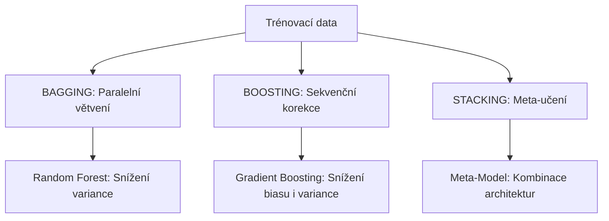
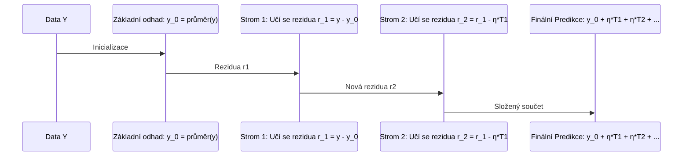

# Teoretický rozbor 7: Ansámblové metody v regresi (Ensemble Methods)

> **Cíl kapitoly:**  
> Pochopit, proč a jak kombinace více „slabých“ či přeučených modelů dramaticky překonává jakýkoliv samostatný rozhodovací strom. Detailně rozebereme dvě dominantní rodiny ansámblů – **Bagging (Random Forest)** a **Boosting (GBDT, XGBoost, LightGBM, CatBoost)** – a jejich teoretický vliv na zkreslení (bias) a varianci.

---

## 1. Motivace: Proč jeden rozhodovací strom nestačí?

V předchozí kapitole jsme viděli dvě zásadní slabiny samostatného rozhodovacího stromu (*Single Decision Tree*):
1. **Vysoká variance a nestabilita:** Malá změna v trénovacích datech může zcela převrátit první rozdělení v kořenovém uzlu a vytvořit naprosto odlišný strom.
2. **Kletba přeučení (Overfitting):** Pokud strom necháme růst, aby zachytil jemné nelinearity, zapamatuje si šum a vytvoří nepřirozené schodovité „věžičky“. Pokud ho omezíme (`max_depth=2`), je příliš hrubý (*underfitting*).

Tento kompromis formálně popisuje **Bias-Variance rozklad chyby**:
$$\mathbb{E}[(y - \hat{f}(x))^2] = \underbrace{\text{Bias}^2(\hat{f}(x))}_{\text{Zkreslení (přílišná jednoduchost)}} + \underbrace{\text{Var}(\hat{f}(x))}_{\text{Rozptyl (citlivost na šum)}} + \underbrace{\sigma^2}_{\text{Neodstranitelný šum}}$$

Ansámblové metody (**Ensemble Learning**) řeší tento problém geniálním způsobem: **místo hledání jednoho kompromisního modelu zkombinují desítky až stovky modelů dohromady.**

---

## 2. BAGGING: Bootstrap Aggregating & Random Forest

Strategie Baggingu zní: **Vezměme modely s nízkým zkreslením a vysokou variancí (hluboké, přeučené stromy) a jejich zprůměrováním varianci eliminujme.**

### 2.1 Princip Bootstrapu
Z původní trénovací sady o velikosti $N$ vytvoříme $B$ nových vzorků stejné velikosti $N$ **náhodným výběrem s opakováním (Bootstrap)**.
- Pravděpodobnost, že konkrétní řádek *nebude* vybrán v jednom tahu, je $1 - \frac{1}{N}$.
- Pro velká $N$ je pravděpodobnost, že řádek nebude vybrán v žádném z $N$ tahů:
  $$\lim_{N \to \infty} \left(1 - \frac{1}{N}\right)^N = \frac{1}{e} \approx 0.368$$
- Každý strom tedy vidí přibližně **63.2 % unikátních dat**.
- Zbývajících **36.8 % dat** se nazývá **Out-Of-Bag (OOB)**. Slouží jako přirozená validační sada pro odhad generalizační chyby bez nutnosti křížové validace (*OOB Score*).

### 2.2 Random Forest (Náhodný les)
Samotný Bagging stromů má problém: pokud je v datech jeden dominantní prediktor, téměř každý bootstrapovaný strom ho vybere v kořenovém uzlu. Stromy pak predikují podobně – jsou **korelované**.

Rozptyl průměru $B$ náhodných veličin s rozptylem $\sigma^2$ a vzájemnou korelací $\rho$ je:
$$\text{Var}(\bar{T}) = \rho \sigma^2 + \frac{1 - \rho}{B} \sigma^2$$

Když $B \to \infty$, druhý člen $\frac{1-\rho}{B}\sigma^2$ klesne k nule, ale **zůstává člen $\rho \sigma^2$**! Abychom snížili celkový rozptyl na minimum, musíme **snížit korelaci $\rho$ mezi stromy**.

Leo Breiman (2001) přidal klíčový krok – **Feature Bagging (Random Subspace Method)**:
> Při každém dělení uzlu strom netestuje všechny prediktory $p$, ale pouze **náhodný podvýběr $m$ příznaků**:
> - Pro regresi se standardně volí: $m = \frac{p}{3}$
> - Pro klasifikaci se volí: $m = \sqrt{p}$

Díky tomu jsou stromy navzájem nekorelované a jejich průměr vytváří překvapivě hladkou a robustní predikční plochu.

---

## 3. BOOSTING: Gradient Boosted Decision Trees (GBDT)

Zatímco Random Forest staví stromy nezávisle vedle sebe, **Boosting je staví za sebou (sekvenčně)**.

Strategie Boostingu zní: **Začněme jednoduchým modelem s vysokým zkreslením (mělký strom) a každý další strom naučme opravovat chyby celého dosavadního týmu.**

### 3.1 Matematický mechanismus Gradient Boostingu pro regresi

1. **Inicializace:** Model začne konstantní predikcí minimalizující ztrátovou funkci $L(y, \hat{y})$ (např. MSE $\frac{1}{2}(y - \hat{y})^2$):
   $$\hat{y}_0(x) = \arg\min_c \sum_{i=1}^N L(y_i, c) = \bar{y}$$
2. **Pro každý krok $m = 1, \dots, M$:**
   - Spočítáme tzv. **pseudo-rezidua** (záporný gradient ztrátové funkce):
     $$r_{im} = -\left[ \frac{\partial L(y_i, \hat{y}(x_i))}{\partial \hat{y}(x_i)} \right]_{\hat{y} = \hat{y}_{m-1}} = y_i - \hat{y}_{m-1}(x_i)$$
   - Natrénujeme nový rozhodovací strom $T_m(x)$ na rezidua $r_{im}$.
   - **Aktualizujeme ansámbl s parametrem rychlosti učení (Learning Rate $\eta$):**
     $$\hat{y}_m(x) = \hat{y}_{m-1}(x) + \eta \cdot T_m(x)$$

> **Shrinkage (Learning Rate $\eta \in (0, 1]$):**  
> Zpomaluje učení. Pokud nastavíme $\eta = 0.05$, každý strom přispěje jen malým dílkem. To nutí následující stromy objevovat obecnější zákonitosti a dramaticky snižuje riziko přetrénování.

---

## 4. Moderní rodina GBDT: XGBoost vs. LightGBM vs. CatBoost

V praxi se málokdy používá základní implementace z čistého Scikit-learnu. Průmyslovým standardem jsou optimalizované knihovny:

| Vlastnost | 🚀 **XGBoost** (2014) | ⚡ **LightGBM** (2016, Microsoft) | 🐱 **CatBoost** (2017, Yandex) |
| :--- | :--- | :--- | :--- |
| **Strategie růstu stromu** | **Level-wise** (po patrech do hloubky) | **Leaf-wise** (větví list s největší ztrátou) | **Symmetric (Oblivious)** stromy |
| **Zpracování kategorií** | Vyžaduje One-Hot nebo Target Enc. | Integer kódování + binning | Špičkový integrovaný Target Encoding |
| **Práce s chybějícími hodnotami** | Automatická (Sparsity-aware split) | Automatická | Automatická |
| **Rychlost trénování** | Rychlý (histogramový mód) | **Extrémně rychlý** (GOSS + EFB) | Střední (pomalejší na CPU, rychlý na GPU) |
| **Inference (produkce)** | Rychlá | Rychlá | **Blesková** (díky symetrickým stromům) |
| **Hlavní přednost** | Léty prověřená stabilita & regularizace | Obrovské datasety (miliony řádků) | Tabulky se spoustou textových kategorií |

---

## 5. STACKING: Super Learner

Stacking nekombinuje stejné modely, ale **různorodé architektury**:
1. **Level-0 (Základní modely):** Natrénujeme různé modely (např. Ridge regrese, Random Forest, LightGBM, SVR).
2. **Generování Out-of-Fold predikcí:** Pomocí $K$-násobné křížové validace získáme nestranné predikce pro každé trénovací pozorování.
3. **Level-1 (Meta-model):** Predikce z Levelu 0 poslouží jako nové vstupní příznaky $X_{\text{meta}}$ pro finální model (obvykle lineární regrese nebo mělký strom), který se naučí optimálně vážit silné stránky jednotlivých algoritmů.

---

## 6. Porovnání: Kdy zvolit jaký model?

| Kritérium | 1 Rozhodovací strom | Random Forest | Gradient Boosting (LightGBM/XGB) |
| :--- | :---: | :---: | :---: |
| **Interpretovatelnost pro laika** | ⭐⭐⭐⭐⭐ (diagram) | ⭐⭐ (Feature Importance) | ⭐⭐ (SHAP hodnoty) |
| **Predikční přesnost** | ⭐⭐ | ⭐⭐⭐⭐ | ⭐⭐⭐⭐⭐ |
| **Odolnost vůči přeučení** | Nízká | **Vysoká** (out-of-the-box) | Střední (vyžaduje ladění $\eta$, $M$) |
| **Náročnost na ladění hyperparametrů** | Nízká | **Minimální** (stačí dostatek stromů) | Vyšší (grid search $\eta$, max_depth, subsample) |
| **Trénovací čas na velkých datech** | Bleskový | Pomalý na velkých datech | Bleskový (LightGBM) |
| **Typické nasazení** | Rychlý baseline, white-box audit | První robustní model bez ladění | Finální soutěžní a produkční model |
