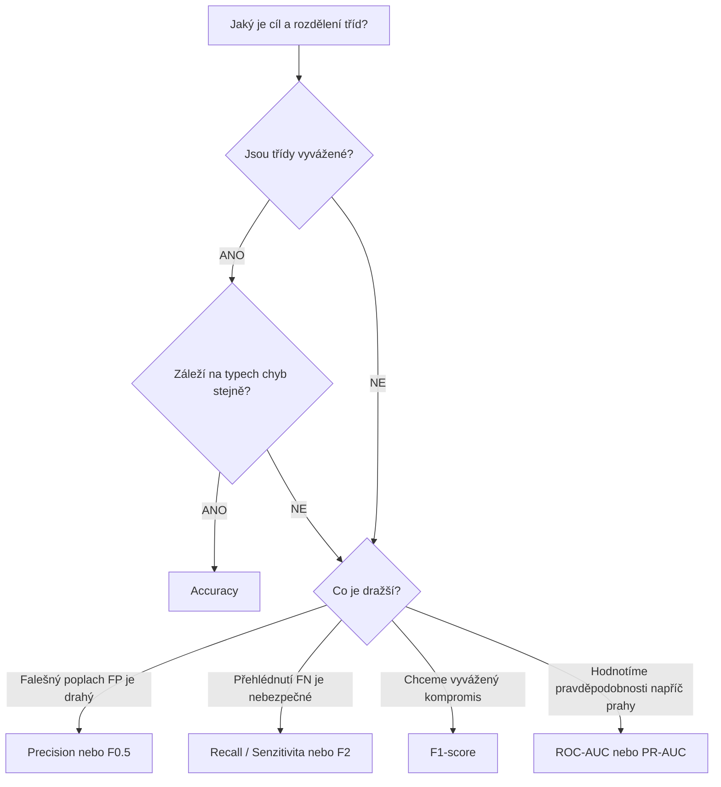

# Metriky klasifikačních modelů: Teoretický rozbor a hodnocení kvality (09/2026)

> **Zdrojové materiály kurzu:**  
> - `Metrics_of_classification_models_-_introduction.pdf` (Základy hodnocení klasifikace, matice záměn, diskrétní metriky, ROC-AUC, Log Loss)  
> - `Metrics_of_classification_models_-_sample_implementation.pdf` (Implementace v Scikit-learn, funkce modulu `sklearn.metrics`, práce s `classification_report`, parametr `average`)

---

## 1. Proč nelze kvalitu klasifikace měřit regresními metrikami?

V regresních úlohách měříme vzdálenost mezi spojitými čísly pomocí odchylek (např. $\text{MAE} = \frac{1}{n} \sum |y_i - \hat{y}_i|$ nebo $\text{RMSE} = \sqrt{\frac{1}{n}\sum(y_i - \hat{y}_i)^2}$).

V klasifikaci je však cílová proměnná **kategoriální** (např. *Normal* vs. *Abnormal*, nebo *Adelie* vs. *Chinstrap* vs. *Gentoo*):
- Mezi třídami neexistuje přirozené uspořádání ani metrická vzdálenost (rozdíl mezi *tučňákem kroužkovým* a *tučňákem uzdičkovým* nelze vyčíslit v milimetrech či dolarech).
- Model predikuje buď **diskrétní přiřazení do třídy** $\hat{y} \in \{0, 1\}$, nebo **aposteriorní pravděpodobnost** $P(Y = 1 \mid X = \mathbf{x}) \in [0, 1]$.
- Chyby v klasifikaci mají **kvalitativně odlišné byznysové a lidské dopady** (falešný poplach má diametrálně jiné následky než přehlédnutý zhoubný nádor).

Proto potřebujeme specializovaný aparát metrik, jehož základem je **matice záměn**.

---

## 2. Matice záměn (Confusion Matrix)

Matice záměn je fundamentální tabulka porovnávající **skutečné štítky (Ground Truth)** s **predikcemi modelu**. Pro binární klasifikaci má rozměr $2 \times 2$:

```text
                           PREDIKOVANÁ TŘÍDA (Predicted)
                             Negativní (0)       Pozitivní (1)
                        +---------------------+---------------------+
         Negativní (0)  |  TN (True Negative) | FP (False Positive) |  <- Chyba I. druhu (Falešný poplach)
SKUTEČNOST              +---------------------+---------------------+
(Actual) Pozitivní (1)  | FN (False Negative) |  TP (True Positive) |  <- Chyba II. druhu (Přehlédnutý případ)
                        +---------------------+---------------------+
```

### Základní kvadranty matice:
1. **TP (True Positive):** Pozitivní stav skutečně nastal a model jej správně predikoval (např. pacient má patologii páteře a model ji odhalil).
2. **TN (True Negative):** Negativní stav byl správně identifikován jako negativní (např. zdravý pacient byl označen jako zdravý).
3. **FP (False Positive – Chyba I. druhu / Falešný poplach):** Skutečnost je negativní, ale model chybně hlásí pozitivní výsledek (např. legitimní bankovní transakce byla zablokována jako podvod; zdravý člověk byl poslán na invazivní biopsii).
4. **FN (False Negative – Chyba II. druhu / Přehlédnutí):** Skutečnost je pozitivní, ale model ji přehlédl a označil za negativní (např. pacient s výhřezem ploténky je poslán domů s tvrzením, že je zdravý; SPAM pronikl do hlavní doručené pošty).

### Školní příklad: SPAM filtr (ze slajdů kurzu)
Mějme testovací sadu 100 emailů (83 SPAM = třída 1, 17 HAM = třída 0):
- $\text{TP} = 70$ (spamy správně zachycené)
- $\text{TN} = 12$ (legitimní zprávy správně doručené)
- $\text{FP} = 5$ (důležité zprávy omylem hozené do spamu)
- $\text{FN} = 13$ (spamy propuštěné do doručené pošty)

---

## 3. Diskrétní klasifikační metriky

Ze 4 polí matice záměn odvozujeme klíčové skalární metriky:

### A. Celková přesnost (Accuracy)
Poměr všech správně klasifikovaných pozorování vůči celému vzorku:

$$\text{Accuracy} = \frac{\text{TP} + \text{TN}}{\text{TP} + \text{TN} + \text{FP} + \text{FN}} = \frac{70 + 12}{100} = 0.82 \quad (82\,\%)$$

> ⚠️ **Paradox přesnosti (Accuracy Paradox):**  
> Accuracy je spolehlivá metrika **pouze tehdy, pokud jsou třídy v datasetu vyvážené** (zhruba 50:50).  
> Pokud detekujeme vzácnou chorobu s výskytem 1 % v populaci, triviální model, který každému pacientovi řekne „jste zdravý“, dosáhne $\text{Accuracy} = 99\,\%$. Přesto je takový model klinicky zcela bezcenný a nebezpečný.

---

### B. Přesnost pozitivních predikcí (Precision / Zpřesnění)
Vyjadřuje: *„Pokud model tvrdí, že vzorek je pozitivní, s jakou pravděpodobností je to pravda?“*

$$\text{Precision} = \frac{\text{TP}}{\text{TP} + \text{FP}} = \frac{70}{70 + 5} = \frac{70}{75} \approx 0.933 \quad (93.3\,\%)$$

- **Kdy optimalizovat Precision:** Když jsou náklady na **False Positive (falešný poplach)** extrémně vysoké.
  - *Bankovní úvěry:* Nechceme půjčit nespolehlivému žadateli.
  - *Doporučování videí / produktů:* Nechceme uživateli nabízet irelevantní obsah.
  - *Právní systémy:* Zásada presumpce neviny („raději propustit 10 viníků než odsoudit jednoho nevinného“).

---

### C. Senzitivita / Záchyt (Recall / Sensitivity / True Positive Rate – TPR)
Vyjadřuje: *„Jaké procento ze všech skutečně pozitivních případů dokázal model najít a zachytit?“*

$$\text{Recall} = \frac{\text{TP}}{\text{TP} + \text{FN}} = \frac{70}{70 + 13} = \frac{70}{83} \approx 0.843 \quad (84.3\,\%)$$

- **Kdy optimalizovat Recall:** Když jsou náklady na **False Negative (přehlédnutí)** katastrofální.
  - *Medicínská diagnostika:* Přehlédnutí nádoru či patologie páteře ohrožuje život pacienta.
  - *Kybernetická bezpečnost:* Přehlédnutí hackerského průniku do sítě.
  - *Letecký průmysl:* Detekce únavových mikrotrhlin v trupu letadla.

---

### D. Specificita (Specificity / True Negative Rate – TNR)
Vyjadřuje schopnost modelu správně rozpoznat negativní vzorky:

$$\text{Specificity} = \frac{\text{TN}}{\text{TN} + \text{FP}} = 1 - \text{FPR}$$

---

### E. F1-score (Harmonický průměr Precision a Recall)
Precision a Recall jdou téměř vždy proti sobě (zvýšení jednoho vede k poklesu druhého). **F1-score** představuje jejich vyvážený kompromis:

$$F_1 = 2 \cdot \frac{\text{Precision} \cdot \text{Recall}}{\text{Precision} + \text{Recall}} = \frac{2\text{TP}}{2\text{TP} + \text{FP} + \text{FN}}$$

Pro náš spamový příklad:
$$F_1 = 2 \cdot \frac{0.9333 \cdot 0.8434}{0.9333 + 0.8434} \approx 0.886 \quad (88.6\,\%)$$

#### Proč harmonický průměr a ne aritmetický?
Aritmetický průměr by při $\text{Precision} = 1.0$ a $\text{Recall} = 0.0$ dal hodnotu $0.5$ (falešný pocit úspěchu). Harmonický průměr v takovém případě nemilosrdně spadne na **0.0**, protože penalizuje extrémní asymetrii mezi oběma metrikami.

#### Zobecnění: $F_\beta$-score
Pokud chceme dát jedné metrice větší váhu než druhé:
$$F_\beta = (1 + \beta^2) \cdot \frac{\text{Precision} \cdot \text{Recall}}{(\beta^2 \cdot \text{Precision}) + \text{Recall}}$$
- $\beta = 2$ ($F_2$-score): Přikládá **2× větší váhu Recallu** než Precision (vhodné pro medicínu).
- $\beta = 0.5$ ($F_{0.5}$-score): Přikládá větší váhu **Precision** (vhodné pro spam filtry a bankovní schvalování).

---

## 4. Prahové a pravděpodobnostní metriky (Threshold-Dependent vs. Invariant)

Většina moderních klasifikátorů (Logistická regrese, Random Forest, k-NN) nevydává přímo binární verdikt 0/1, ale **spojité pravděpodobnostní skóre** $p \in [0, 1]$. O konečné třídě rozhoduje zvolený **rozhodovací práh (Classification Threshold)**:

$$\hat{y} = \begin{cases} 1 & \text{pokud } p \ge \theta \\ 0 & \text{pokud } p < \theta \end{cases}$$

Výchozí práh je obvykle $\theta = 0.5$. Posunem prahu $\theta$ můžeme přímo řídit poměr mezi Precision a Recall:
- **Zvýšení prahu ($\theta = 0.8$):** Model hlásí pozitivní stav jen při vysoké jistotě $\implies$ **vysoká Precision, nízký Recall**.
- **Snížení prahu ($\theta = 0.2$):** Model je velmi opatrný a hlásí pozitivní stav i při malém podezření $\implies$ **vysoký Recall, nižší Precision**.

---

### A. ROC křivka (Receiver Operating Characteristic) a ROC-AUC
ROC křivka vizualizuje výkonnost binárního klasifikátoru **napříč všemi možnými prahy $\theta \in [0, 1]$**:
- **Osa X:** $\text{False Positive Rate (FPR)} = \frac{\text{FP}}{\text{FP} + \text{TN}} = 1 - \text{Specificity}$
- **Osa Y:** $\text{True Positive Rate (TPR)} = \frac{\text{TP}}{\text{TP} + \text{FN}} = \text{Recall / Senzitivita}$

```text
  TPR (Recall) ^
           1.0 |         * * * * * * [Perfektní model: AUC = 1.0]
               |       *
               |     *               [Kvalitní model: AUC ≈ 0.85]
               |   *
               |  *
               | /  <- Náhodný odhad (flambování mincí): AUC = 0.5
           0.0 +-----------------------------------> FPR (1 - Specificity)
              0.0                                1.0
```

#### Interpretace ROC-AUC:
- **$\text{AUC} = 1.0$:** Dokonalý klasifikátor. Existuje práh, který bezchybně oddělí obě třídy.
- **$\text{AUC} = 0.5$:** Model nemá žádnou rozlišovací schopnost (odpovídá náhodnému hodu mincí).
- **$\text{AUC} < 0.5$:** Model předpovídá hůře než náhoda (invertováním predikcí získáme model s $\text{AUC} > 0.5$).
- **Pravděpodobnostní význam:** ROC-AUC je exaktně rovna pravděpodobnosti, že náhodně vybraný pozitivní pacient dostane od modelu vyšší skóre než náhodně vybraný zdravý pacient.

---

### B. Logaritmická ztráta (Log Loss / Binary Cross-Entropy)
Log Loss hodnotí nikoli samotné zařazení do tříd, ale **přesnost a kalibraci odhadnutých pravděpodobností**:

$$\text{Log Loss} = -\frac{1}{N} \sum_{i=1}^N \left[ y_i \ln(p_i) + (1 - y_i) \ln(1 - p_i) \right]$$

Kde:
- $y_i \in \{0, 1\}$ je skutečný štítek.
- $p_i = P(\hat{y}_i = 1)$ je pravděpodobnost odhadnutá modelem.

> **Klíčová vlastnost:** Log Loss **exponenciálně trestá přehnanou sebevědomost při nesprávné predikci**. Pokud model s jistotou $p = 0.999$ tvrdí, že pacient je zdravý ($y=0$), ale pacient má ve skutečnosti patologii ($y=1$), Log Loss vystřelí k nekonečnu.

---

## 5. Vícetřídní klasifikace a strategie průměrování (`average`)

U problémů s více než dvěma třídami (např. Palmer Penguins se 3 druhy) počítáme metriky pro každou třídu zvlášť. Knihovna Scikit-learn nabízí v parametru `average` 4 strategie agregace:

| Režim | Princip výpočtu | Kdy použít |
| :--- | :--- | :--- |
| **`macro`** | Aritmetický průměr metrik jednotlivých tříd: $\frac{1}{K}\sum M_k$. Každá třída má **stejnou váhu**. | Když záleží na všech třídách stejně (i na minoritních). |
| **`weighted`** | Vážený průměr metrik podle počtu vzorků v každé třídě: $\sum \frac{N_k}{N} M_k$. | Když chceme zohlednit přirozené zastoupení tříd v populaci. |
| **`micro`** | Globální agregace: sečtou se všechna TP, FP, FN napříč třídami a metrika se spočte najednou. | U multi-label úloh (odpovídá celkové Accuracy). |
| **`binary`** | Výchozí volba určená výhradně pro 2 třídy. | Standardní binární klasifikace. |

---

## 6. Implementace v Scikit-learn (`sklearn.metrics`)

Scikit-learn poskytuje ucelenou sadu funkcí v modulu `sklearn.metrics`:

```python
from sklearn.metrics import (
    accuracy_score,
    precision_score,
    recall_score,
    f1_score,
    roc_auc_score,
    roc_curve,
    confusion_matrix,
    classification_report
)

# 1. Matice záměn
cm = confusion_matrix(y_true, y_pred)

# 2. Jednotlivé skalární metriky
acc = accuracy_score(y_true, y_pred)
prec = precision_score(y_true, y_pred, average="weighted")
rec = recall_score(y_true, y_pred, average="weighted")
f1 = f1_score(y_true, y_pred, average="weighted")

# 3. Výpočet ROC křivky a AUC (vyžaduje pravděpodobnosti, nikoliv třídy!)
y_scores = model.predict_proba(X_test)[:, 1]
fpr, tpr, thresholds = roc_curve(y_true, y_scores)
auc = roc_auc_score(y_true, y_scores)

# 4. Komplexní zpráva na jeden řádek
report = classification_report(y_true, y_pred, target_names=["Třída A", "Třída B"])
print(report)
```

---

## 7. Rychlý průvodce: Jakou metriku zvolit v praxi?


