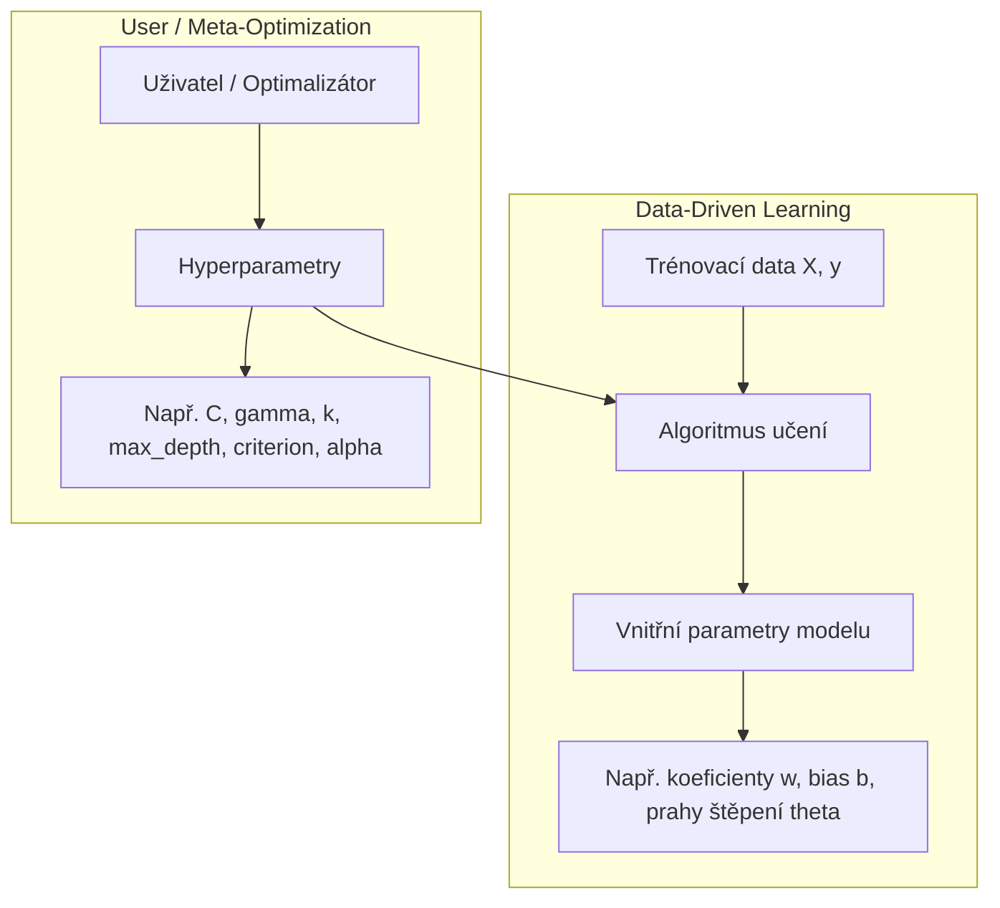
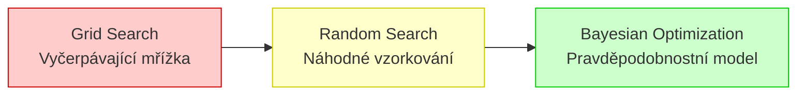

# Optimalizace hyperparametrů a křížová validace (Cross-Validation)

> **Základní kontext:**  
> První víkendový blok kurzu Data Science & Machine Learning byl věnován základním regresním a klasifikačním algoritmům. V průběhu těchto úloh jsme hyperparametry ladili manuálně pomocí jednoduchých `for` cyklů a testovacích sad. Tento dokument otevírá **2. blok (Session 2)** a představuje systematické, rigorózní a výpočetně efektivní metody pro vyhledávání optimální konfigurace modelů.

---

## 1. Parametry vs. Hyperparametry: Zásadní rozdíl

V Machine Learningu je striktní rozlišení mezi tím, co se model **učí sám**, a tím, co mu **musí zadat člověk**:

### Srovnávací přehled

| Vlastnost | Vnitřní parametry (Model Parameters) | Hyperparametry (Model Hyperparameters) |
| :--- | :--- | :--- |
| **Definice** | Vnitřní proměnné modelu determinované přímo z dat během trénování. | Konfigurační volby zadané předem, které řídí chování a kapacitu učícího algoritmu. |
| **Způsob určení** | Optimalizační algoritmus (OLS rovnice, Gradient Descent, CART, SMO). | Uživatel, Grid Search, Random Search, Bayesovská optimalizace. |
| **Uložení v scikit-learn** | Atributy s podtržítkem na konci: `coef_`, `intercept_`, `tree_`. | Argumenty konstruktoru: `C=1.0`, `max_depth=3`, `n_neighbors=5`. |
| **Příklady napříč modely** | • OLS / Ridge / Lasso: váhy $w_1, \dots, w_p$, intercept $b$ • Logistická regrese: logitové váhy $\mathbf{w}$ • Rozhodovací strom: konkrétní štěpící prahy $\theta_j$ a struktura větví • SVM: duální multiplikátory $\alpha_i$ a podpůrné vektory | • Ridge / Lasso: penalizační koeficient $\alpha$ • k-NN: počet sousedů $k$, váhování `weights`, metrika `metric` • Logistická regrese: inverzní penalizace $C$, norma `penalty` • Strom: `max_depth`, `min_samples_split`, `criterion` • SVM: penalizace $C$, jádro `kernel`, koeficient `gamma` |

---

## 2. Křížová validace (Cross-Validation)

### Proč pouhý `train_test_split` nestačí?
Doposud jsme data dělili na trénovací a testovací sadu (např. 75/25 nebo 70/30). Ačkoliv je tento přístup rychlý a chrání před triviálním přeučením, nese zásadní úskalí:
1. **Náhodnost rozdělení (Split Variance):** Výsledek testovací metriky silně závisí na tom, jaké vzorky náhodou spadly do testovací sady (`random_state`). U menších datasetů (např. 310 pacientů u páteře) může změna seedu změnit Precision o 5 až 10 procentních bodů!
2. **Plýtvání daty:** 20 až 30 % dat je odloženo a model se z nich neučí.
3. **Únik informací při tuningu (Data Leakage / Overfitting na testovací sadu):** Pokud hyperparametry opakovaně ladíme tak, aby dávaly nejlepší výsledek na testovací sadě, testovací sada přestává být nezávislá! Model se stane „přeučený na konkrétní testovací sadu“.

### Princip $K$-Fold Cross-Validation (K-násobná křížová validace)
Při $K$-násobné křížové validaci (např. $K=4$ nebo $K=5$):
1. Celá trénovací data se náhodně rozdělí do $K$ stejně velkých částí (tzv. **foldů**).
2. Proběhne **$K$ tréninkových a evaluačních cyklů**:
   - V každém kroku slouží přesně **jeden fold jako validační** sada.
   - Zbývajících **$K-1$ foldů slouží jako trénovací** sada.
3. Výsledné validační skóre je průměrem (a směrodatnou odchylkou) napříč všemi $K$ iteracemi:

$$\mu_{\text{metric}} = \frac{1}{K}\sum_{i=1}^{K} \text{score}_i, \quad \sigma_{\text{metric}} = \sqrt{\frac{1}{K}\sum_{i=1}^{K} (\text{score}_i - \mu_{\text{metric}})^2}$$

```mermaid
graph TD
    subgraph Iterace 1
        A1[Fold 1: TEST] --- B1[Fold 2: Train] --- C1[Fold 3: Train] --- D1[Fold 4: Train]
    end
    subgraph Iterace 2
        A2[Fold 1: Train] --- B2[Fold 2: TEST] --- C2[Fold 3: Train] --- D2[Fold 4: Train]
    end
    subgraph Iterace 3
        A3[Fold 1: Train] --- B3[Fold 2: Train] --- C3[Fold 3: TEST] --- D3[Fold 4: Train]
    end
    subgraph Iterace 4
        A4[Fold 1: Train] --- B4[Fold 2: Train] --- C4[Fold 3: Train] --- D4[Fold 4: TEST]
    end
```

### Stratifikovaný $K$-Fold (StratifiedKFold)
U klasifikačních úloh s nevyváženými třídami je nezbytné zajistit, aby **každý fold obsahoval přesně stejné procentuální zastoupení jednotlivých tříd** jako původní dataset. V scikit-learn je pro klasifikaci výchozí volbou `StratifiedKFold`.

---

## 3. Strategie prohledávání prostoru hyperparametrů

Hledání optimální kombinace hyperparametrů $\boldsymbol{\theta}^* \in \Theta$ lze řešit třemi hlavními strategiemi:

### 1. Grid Search (Mřížkové prohledávání)
- **Mechanismus:** Definujeme diskrétní mřížku hodnot pro každý hyperparametr (např. $C \in \{0.1, 1, 10\}$, $\text{max\_depth} \in \{2, 3, 5\}$). Algoritmus otestuje **kartézský součin všech možných kombinací**.
- **Kombinatorická exploze:**
  Pokud máme $P$ hyperparametrů a každý má $V$ hodnot, celkový počet kombinací je:
  $$N_{\text{kombinací}} = V^P$$
  Při $K$-násobné křížové validaci musíme natrénovat:
  $$N_{\text{modelů}} = K \cdot V^P$$
  *Příklad:* 10 hyperparametrů, každý s 10 hodnotami $\implies 10^{10} = 10\,000\,000\,000$ kombinací! I kdyby trénink jednoho modelu trval 1 milisekundu, výpočet zabere přes 300 let!
- **Výhoda:** Deterministický, zaručeně najde nejlepší bod z definované diskrétní mřížky.
- **Nevýhoda:** Testuje pouze explicitně zadané body; hodnoty mezi mřížkovými body zůstávají neprozkoumané.

### 2. Random Search (Náhodné prohledávání)
- **Mechanismus:** Namísto fixní diskrétní mřížky specifikujeme intervaly nebo pravděpodobnostní rozdělení (např. rovnoměrné, log-uniformní pro $C$ či $\alpha$). Algoritmus náhodně vybere $N_{\text{iter}}$ vzorků.
- **Teoretická výhoda (Bergstra & Bengio, 2012):**
  Ve většině úloh strojového učení má pouze malý podmnožina hyperparametrů dramatický vliv na výsledek (vysoká efektivní dimenze vs. nízká relevantní dimenze).
  - Mřížka $3 \times 3$ otestuje pouze 3 unikátní hodnoty důležitého parametru.
  - Random Search s 9 iteracemi otestuje **9 různých unikátních hodnot** důležitého parametru!
- **Výhoda:** Rychlejší pokrytí prostoru, kontrola nad celkovým výpočetním časem přes parametr $N_{\text{iter}}$.

### 3. Bayesovská optimalizace (Bayesian Search / Optuna / Hyperopt)
- **Mechanismus:** Problém hledání hyperparametrů vnímá jako optimalizaci neznámé černé skříňky (black-box function) $f(\boldsymbol{\theta}) = \text{Validation Score}$.
- **Surrogate Model (Náhradní model):**
  Na základě dosud spočtených pokusů vytvoří pravděpodobnostní model (např. Gaussovský proces nebo TPE – *Tree-structured Parzen Estimator*), který aproximuje nejen očekávanou hodnotu metriky $\mu(\boldsymbol{\theta})$, ale i **míru nejistoty** $\sigma(\boldsymbol{\theta})$.
- **Akviziční funkce (Acquisition Function):**
  Rozhoduje, jaký bod vyzkoušet příště. Balancuje mezi:
  - **Exploitation (Vytěžování):** Prozkoumávání oblastí, kde model očekává vysoký zisk.
  - **Exploration (Průzkum):** Prozkoumávání oblastí s vysokou nejistotou (málo prozkoumané regiony).
- **Metafora:** Jako **hledání pokladu na základě stop** – po každém vykopání díry víme víc o terénu a další výkop plánujeme tam, kde je nejvyšší šance na nalezení ještě většího pokladu.

---

## 4. Souhrnná komparativní tabulka strategií

| Kritérium | Grid Search (`GridSearchCV`) | Random Search (`RandomizedSearchCV`) | Bayesian Optimization (`Optuna` / `Hyperopt`) |
| :--- | :--- | :--- | :--- |
| **Přístup k prohledávání** | Vyčerpávající systematická mřížka | Náhodný výběr ze spojitých/diskrétních distribucí | Sekvenční modelování s adaptivním učením |
| **Škálovatelnost s počtem parametrů** | Velmi špatná (kombinatorická exploze) | Velmi dobrá (nezávislá na dimenzionalitě) | Vynikající (efektivní i v desítkách parametrů) |
| **Spojité parametry** | Vyžaduje diskretizaci na několik bodů | Přirozeně vzorkuje ze spojitých rozdělení | Přirozeně modeluje hladké spojité funkce |
| **Závislost mezi pokusy** | Žádná (paralelizovatelné, hloupé) | Žádná (paralelizovatelné, hloupé) | Vysoká (každý pokus využívá historii předchozích) |
| **Implementace v Scikit-learn** | Přímo v `sklearn.model_selection` | Přímo v `sklearn.model_selection` | Externí knihovny (`optuna`, `scikit-optimize`, `hyperopt`) |
| **Doporučené nasazení** | 1 až 2 parametry s jasným rozsahem | Rychlý hrubý screening pro 3+ parametrů | Finální ladění složitých modelů (GBDT, XGBoost, NN) |

---

## 5. Zlatá pravidla správného tuningu

1. **Nikdy neladit na finální testovací sadě:**
   Data rozdělte na `Train` a `Test`. Křížovou validaci a tuning provádějte **výhradně na trénovací sadě** (`X_train`, `y_train`). Finální model pak jednou otestujte na dosud nespatřené sadě `X_test`.
2. **Předspracování (Scaling) musí být uvnitř Pipeline:**
   Pokud normalizujete data před křížovou validací na celém datasetu, dochází k **úniku informací (data leakage)**, protože průměr a rozptyl validačního foldu ovlivnily škálování trénovacího foldu! Vždy používejte `sklearn.pipeline.Pipeline`.
3. **Logaritmické škály pro multiplikativní parametry:**
   Parametry jako $C, \alpha, \gamma$ se ladí v řádech velikostí (např. $10^{-3}, 10^{-2}, \dots, 10^2$), nikoliv lineárně ($1, 2, 3, 4$).
