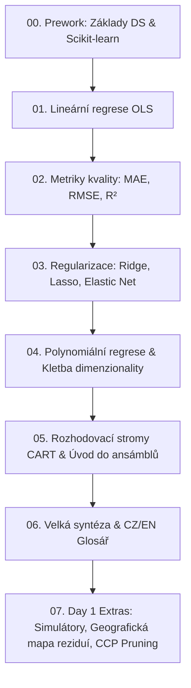

# 🔬 Data Science & Machine Learning Portfolio (Streamlit App)

[](https://www.python.org/)
[](https://streamlit.io/)
[](https://scikit-learn.org/)
[](https://plotly.com/)
[](https://coderslab.cz/cz/)

> Komplexní interaktivní výuková platforma a analytické portfolio pro regresní modelování, strojové učení a diagnostiku modelů v Pythonu.

---

## 🎓 Uznání autorství & Poděkování (Attribution)

Základní pedagogická struktura, datové sady a cvičení v tomto projektu vycházejí z materiálů a sylabu akreditovaného kurzu **Data Science / Machine Learning** vzdělávací IT akademie **[Coders Lab Česká republika](https://coderslab.cz/cz/)**.

Tento repozitář rozšiřuje původní osnovy kurzu o:
- Moderní **Streamlit webovou aplikaci** s interaktivními vizualizacemi v Plotly.
- **What-If inferenční simulátory** napojené na reálně natrénované Scikit-learn modely.
- **Expertní diagnostiku:** Gauss-Markovovy teorémy, analýzu multikolinearity (VIF), prostorovou mapu reziduí v Seattlu a Cost-Complexity Pruning rozhodovacích stromů.
- **Rigorózní metodické rozbory:** eliminaci Data Leakage, správnou práci s křížovou validací (`GridSearchCV`) a ochranu před přetrénováním.

---

## 🌟 O projektu & Architektura aplikace

Aplikace slouží jako referenční příručka a praktická laboratoř pro **Den 1: Regresní modely (Supervised Learning)**. Každé téma je rozděleno do tří provázaných pilířů:

1. **📖 Teoretický základ:** Matematické formulace ($y = \mathbf{X}\boldsymbol{\beta} + \varepsilon$, ztrátové funkce, regularizační pokuty), geometrické interpretace a metodické poznámky.
2. **🎯 Školní výsledky zadání:** Přesné splnění úloh z kurzu včetně natrénování modelů a vyhodnocení základních metrik.
3. **🔬 Expertní analýza & Kritika:** Hlubší vhled za hranice základních zadání (analýza časového posunu u nemovitostí, gemologické paradoxy u diamantů, Rungeův jev u polynomů, prořezávání stromů).



---

## 📊 Reálné datasety & Benchmarky

Experimenty jsou prováděny na dvou reálných datových sadách z praxe:

### 1. Nemovitosti v King County, Seattle (`kc_house_data.csv`)
- **21 613 prodejů domů** z let 2014–2015.
- Cíl: Predikce prodejní ceny na základě plochy, lokality, stavu a počtu pokojů.
- **Baseline OLS:** $R^2 \approx 0.695$, $\text{RMSE} \approx 203\,150\text{ USD}$
- **Optimální rozhodovací strom (GridSearchCV):** $R^2 = 0.793$, $\text{RMSE} = 176\,810\text{ USD}$  
  *(Díky schopnosti ohraničit prestižní čtvrti pomocí souřadnic `lat` a `long` strom snížil chybu RMSE o téměř 35 000 USD).*

### 2. Diamanty (`diamonds.csv`)
- **53 908 certifikovaných diamantů** hodnocených dle gemologických standardů 4C (Carat, Cut, Color, Clarity).
- Cíl: Predikce ceny a zachycení nelineárního růstu hodnoty s hmotností.
- **Lineární OLS:** $R^2 = 0.9095$, $\text{RMSE} = 1\,172.5\text{ USD}$
- **Polynom 2. stupně (Kvadratický OLS):** $R^2 = 0.9655$, $\text{RMSE} = 723.7\text{ USD}$
- **Polynom 3. stupně (Surový OLS):** $R^2 = 0.8591$, $\text{RMSE} = 1\,463.0\text{ USD}$ *(Kolaps variance kvůli multikolinearitě 219 členů!)*
- **Polynom 3. stupně + Ridge ($\alpha=100$):** $R^2 = 0.9744$, $\text{RMSE} = 623.2\text{ USD}$ *(Záchrana modelu regularizací)*
- **Optimální rozhodovací strom (GridSearchCV):** $R^2 = 0.9785$, $\text{RMSE} = 587.0\text{ USD}$, $\text{MAE} = 307.3\text{ USD}$  
  *(Dokonale zachycuje psychologické cenové skoky u kulatých karátů `carat >= 1.00`).*

---

## 🎛️ Hlavní interaktivní funkce (Day 1 Extras)

- **🎛️ What-If simulátor inference:** Kalkulátor cen domů i diamantů volající **skutečně natrénované Scikit-learn pipeliny** v reálném čase.
- **🗺️ Geografická mapa reziduí Seattlu:** Interaktivní mapa 1 500 nemovitostí s barevným vyznačením chyb ($y - \hat{y}$) odhalující, kde přesně OLS selhává a jak strom lokalizuje bohaté pobřežní oblasti.
- **🔬 Diagnostika Gauss-Markov:** Ověření předpokladů pro vlastnost BLUE (Best Linear Unbiased Estimator) a interaktivní analýza multikolinearity přes VIF faktor.
- **🌲 Cost-Complexity Pruning (`ccp_alpha`):** Vizuální sledování prořezávání rozhodovacího stromu od masivního přeučení ($>36\,000$ listů) až k optimálnímu generalizovanému modelu.
- **🌳 Průvodce výběrem modelu:** Interaktivní rozhodovací diagram v SVG pro volbu správného algoritmu v byznysové praxi.
- **📥 Scikit-learn Cheatsheet:** Kompletní tahák v PDF ke stažení vygenerovaný přes ReportLab.

---

## 🚀 Jak aplikaci spustit lokálně (Quickstart)

### 1. Klonování repozitáře
```bash
git clone https://github.com/Kilitar/Coderslab-DataScience.git
cd Coderslab-DataScience
```

### 2. Vytvoření virtuálního prostředí
```bash
# Windows (PowerShell)
python -m venv .venv
.\.venv\Scripts\Activate.ps1

# Linux / macOS
python3 -m venv .venv
source .venv/bin/activate
```

### 3. Instalace závislostí
```bash
pip install --upgrade pip
pip install -r requirements.txt
```

### 4. Spuštění Streamlit aplikace
```bash
streamlit run app.py
```
Aplikace se automaticky otevře ve vašem výchozím webovém prohlížeči na adrese `http://localhost:8501`.

---

## 📂 Struktura repozitáře

```text
Coderslab-DataScience/
├── app.py                                # Hlavní vstupní bod Streamlit aplikace (navigace)
├── requirements.txt                      # Seznam závislostí pro běh projektu
├── 01_Regression/                        # Podklady, skripty a teorie pro Den 1
│   ├── 01_linear_regression_exercise_1.py
│   ├── 02_linear_regression_exercise_2.py
│   ├── 03_regression_metrics_exercise_1.py
│   ├── 04_regression_metrics_exercise_2.py
│   ├── 05_regularization_exercise_1.py
│   ├── 06_regularization_exercise_2.py
│   ├── 07_polynomial_regression_exercise.py
│   ├── 08_decision_tree_exercise_1.py
│   ├── 09_decision_tree_exercise_2.py
│   ├── data/                            # Datové sady (CSV) a optimalizované JSON cache
│   │   ├── kc_house_data.csv
│   │   ├── diamonds.csv
│   │   ├── diamonds_poly_precomputed.json
│   │   └── kc_time_analysis_precomputed.json
│   └── theory/                          # Detailní teoretické průvodce a rekapitulace
│       ├── 01_linear_regression_theory.md
│       ├── 02_regression_metrics_theory.md
│       ├── 03_regularization_theory.md
│       ├── 05_polynomial_regression_theory.md
│       ├── 06_decision_tree_regression_theory.md
│       └── 07_day_1_summary.md
└── views/                               # Jednotlivé podstránky Streamlit aplikace
    ├── 00_home.py                       # Úvodní rozcestník a sylabus
    ├── 00_prework_*.py                  # Moduly přípravného bloku (Prework)
    ├── 01_*.py                          # Stránky úloh, notebooků a analýz Dne 1
    └── 01_extras_*.py                   # Day 1 Extras (What-If, Mapy, Pruning, Taháky)
```

---

## 🛠️ Použité technologie & Knihovny

- **Frontend & Dashboard:** [Streamlit](https://streamlit.io/)
- **Machine Learning & Preprocessing:** [Scikit-learn](https://scikit-learn.org/) (LinearRegression, Ridge, Lasso, ElasticNet, DecisionTreeRegressor, HistGradientBoostingRegressor, StandardScaler, PolynomialFeatures)
- **Data Wrangling:** [Pandas](https://pandas.pydata.org/), [NumPy](https://numpy.org/)
- **Interaktivní vizualizace:** [Plotly Express & Graph Objects](https://plotly.com/python/)
- **Generování PDF:** [ReportLab](https://www.reportlab.com/)

---

## 📜 Licence & Podmínky užití

Tento projekt je určen pro vzdělávací a studijní účely v rámci studia Data Science. Původní koncepty úloh náleží vzdělávací akademii **[Coders Lab](https://coderslab.cz/cz/)**. Kód implementace aplikace, interaktivní moduly a doplňující analýzy jsou volně k dispozici pod licencí MIT.
