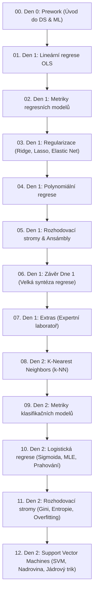

# 🔬 Data Science & Machine Learning Portfolio (Streamlit App)

[](https://www.python.org/)
[](https://streamlit.io/)
[](https://scikit-learn.org/)
[](https://plotly.com/)
[](https://coderslab.cz/cz/)
[](https://deepmind.google/)

> Komplexní interaktivní výuková platforma a analytické portfolio pro regresní modelování, strojové učení a diagnostiku modelů v Pythonu.

---

## 🎓 Uznání autorství, AI orchestrace & Poděkování (Attribution)

### 🏫 Vzdělávací základ & Kurikulum
Základní pedagogická struktura, datové sady a cvičení v tomto projektu vycházejí z materiálů a sylabu akreditovaného kurzu **Data Science / Machine Learning** vzdělávací IT akademie **[Coders Lab Česká republika](https://coderslab.cz/cz/)**.

### 🤖 Realizace & Autonomní AI Orchestrace (Google Antigravity)
Tento repozitář byl koncipován, architektonicky navržen a softwarově implementován formou **pokročilého párového programování (Pair Programming) a agentní AI orchestrace v prostředí [Google Antigravity (Antigravity IDE)](https://deepmind.google/)**.

- **Synergie člověk + AI:** Uživatel definuje strategické zadání, věcné mantinely a ověřuje pedagogickou integritu; AI agent Antigravity obstarává end-to-end softwarové inženýrství, matematické formulace v KaTeX, konstrukci Scikit-learn pipeline, diagnostiku chyb, generování interaktivních komponent v Plotly/Streamlit a automatické spouštění Jupyter sešitů.
- **Přidaná hodnota nad rámec původních osnov:**
  - Moderní **Streamlit webová aplikace** s interaktivními vizualizacemi v Plotly a hierarchickou navigací.
  - **What-If inferenční simulátory** napojené na reálně natrénované Scikit-learn modely v reálném čase.
  - **Expertní diagnostika:** Gauss-Markovovy teorémy, analýza multikolinearity (VIF), prostorová mapa odchylek v cenách nemovitostí v Seattlu, Cost-Complexity Pruning rozhodovacích stromů a geometrický rozbor metrik k-NN.
  - **Rigorózní metodické rozbory:** eliminace Data Leakage, správná práce s křížovou validací (`GridSearchCV`, `StratifiedKFold`) a ochrana před přetrénováním.

---

## 🌟 O projektu & Architektura aplikace

Aplikace slouží jako referenční příručka a praktická laboratoř pro **Den 1: Regresní modely (Supervised Learning)**. Každé téma je rozděleno do tří provázaných pilířů:

1. **📖 Teoretický základ:** Matematické formulace ($y = \mathbf{X}\boldsymbol{\beta} + \varepsilon$, ztrátové funkce, regularizační pokuty), geometrické interpretace a metodické poznámky.
2. **🎯 Školní výsledky zadání:** Přesné splnění úloh z kurzu včetně natrénování modelů a vyhodnocení základních metrik.
3. **🔬 Expertní analýza & Kritika:** Hlubší vhled za hranice základních zadání (analýza časového posunu u nemovitostí, gemologické paradoxy u diamantů, Rungeův jev u polynomů, prořezávání stromů).


```mermaid
flowchart TD
    A["00. Den 0: Prework (Úvod do DS & ML)"] --> B["01. Den 1: Lineární regrese OLS"]
    B --> C["02. Den 1: Metriky regresních modelů"]
    C --> D["03. Den 1: Regularizace (Ridge, Lasso, Elastic Net)"]
    D --> E["04. Den 1: Polynomiální regrese"]
    E --> F["05. Den 1: Rozhodovací stromy & Ansámbly"]
    F --> G["06. Den 1: Závěr Dne 1 (Velká syntéza regrese)"]
    G --> H["07. Den 1: Extras (Expertní laboratoř)"]
    H --> I["08. Den 2: K-Nearest Neighbors (k-NN)"]
    I --> J["09. Den 2: Metriky klasifikačních modelů"]
    J --> K["10. Den 2: Logistická regrese (Sigmoida, MLE, Prahování)"]
    K --> L["11. Den 2: Rozhodovací stromy (Gini, Entropie, Overfitting)"]
    L --> M["12. Den 2: Support Vector Machines (SVM, Nadrovina, Jádrový trik)"]
```

---

## 📊 Reálné datasety & Benchmarky

Experimenty jsou prováděny na reálných datových sadách z praxe:

### 1. Nemovitosti v King County, Seattle (`kc_house_data.csv`)
- **21 613 prodejů domů** z let 2014–2015.
- Cíl: Predikce prodejní ceny na základě plochy, lokality, stavu a počtu pokojů.
- **Baseline OLS:** $R^2 \approx 0.695$, $\text{RMSE} \approx 203\,150\text{ USD}$
- **Optimální rozhodovací strom (GridSearchCV):** $R^2 = 0.793$, $\text{RMSE} = 176\,810\text{ USD}$  
  *(Díky schopnosti ohraničit prestižní čtvrti pomocí souřadnic `lat` a `long` strom snížil chybu RMSE o téměř 35 000 USD).*

### 2. Diamanty (`diamonds.csv`)
- **53 908 certifikovaných diamantů** hodnocených dle gemologických standardů 4C (Carat, Cut, Color, Clarity).
- Cíl: Predikce ceny a zachycení nelineárního růstu hodnoty s hmotností.
- **Lineární OLS:** $R^2 = 0.9095$, $\text{RMSE} = 1\,172.5\text{ USD}$
- **Polynom 2. stupně (Kvadratický OLS):** $R^2 = 0.9655$, $\text{RMSE} = 723.7\text{ USD}$
- **Polynom 3. stupně (Surový OLS):** $R^2 = 0.8591$, $\text{RMSE} = 1\,463.0\text{ USD}$ *(Kolaps variance kvůli multikolinearitě 219 členů!)*
- **Polynom 3. stupně + Ridge ($\alpha=100$):** $R^2 = 0.9744$, $\text{RMSE} = 623.2\text{ USD}$ *(Záchrana modelu regularizací)*
- **Optimální rozhodovací strom (GridSearchCV):** $R^2 = 0.9785$, $\text{RMSE} = 587.0\text{ USD}$, $\text{MAE} = 307.3\text{ USD}$  
  *(Dokonale zachycuje psychologické cenové skoky u kulatých karátů `carat >= 1.00`).*

### 3. Antarktičtí tučňáci Palmer Penguins (`penguins_size.csv`)
- **344 tučňáků** tří druhů (*Adelie*, *Chinstrap*, *Gentoo*) ze souostroví Palmer.
- Cíl: Multitřídní klasifikace druhu na základě morfologie (zobák, ploutev, hmotnost, ostrov, pohlaví).
- **Školní baseline (bez škálování, $k=5$):** $\text{Accuracy} \approx 80.6\,\%$ *(Hmotnost v gramech tvořila $99.98\,\%$ celkové vzdálenosti!)*
- **Plný Pipeline s OneHot kódováním ostrova a pohlaví:** $\text{Accuracy} = 99.0\,\%$, $\text{CV} = 100.0\,\%$

### 4. Biomechanika bederní páteře (`lumbar_data.csv`)
- **310 pacientů** (100 zdravých `Normal`, 210 s diagnózou `Abnormal`: výhřez ploténky *Hernia* a posun obratle *Spondylolisthesis*).
- Cíl: Klinická klasifikace stavu páteře na základě 6 anatomických úhlů pánve.
- **Školní model ($k=5$, $L_2$ normalizace):** $\text{Accuracy} = 73.08\,\%$, $\text{Recall} = 80.70\,\%$, $\text{ROC-AUC} = 0.8208$.
- **Optimální model se stratifikací ($k=8$):** $\text{Accuracy} = 88.46\,\%$, $\text{Recall} = 88.68\,\%$.

---

## 🎛️ Hlavní interaktivní funkce (Day 1 Extras)

- **🎛️ What-If simulátor inference:** Kalkulátor cen domů i diamantů volající **skutečně natrénované Scikit-learn pipeliny** v reálném čase.
- **🗺️ Geografická mapa nemovitostí v Seattlu:** Interaktivní mapa 1 500 domů s barevným vyznačením odchylek v odhadu cen ($y - \hat{y}$) odhalující, kde přesně OLS selhává a jak strom lokalizuje bohaté pobřežní oblasti.
- **🔬 Diagnostika Gauss-Markov:** Ověření předpokladů pro vlastnost BLUE (Best Linear Unbiased Estimator) a interaktivní analýza multikolinearity přes VIF faktor.
- **🌲 Cost-Complexity Pruning (`ccp_alpha`):** Vizuální sledování prořezávání rozhodovacího stromu od masivního přeučení ($>36\,000$ listů) až k optimálnímu generalizovanému modelu.
- **🌳 Průvodce výběrem modelu:** Interaktivní rozhodovací diagram v SVG pro volbu správného algoritmu v byznysové praxi.
- **📥 Scikit-learn Cheatsheet:** Kompletní tahák v PDF ke stažení vygenerovaný přes ReportLab.

---

## 🚀 Jak aplikaci spustit lokálně (Quickstart)

### 1. Klonování repozitáře
```bash
git clone https://github.com/Kilitar/Coderslab-DataScience.git
cd Coderslab-DataScience
```

### 2. Vytvoření virtuálního prostředí
```bash
# Windows (PowerShell)
python -m venv .venv
.\.venv\Scripts\Activate.ps1

# Linux / macOS
python3 -m venv .venv
source .venv/bin/activate
```

### 3. Instalace závislostí
```bash
pip install --upgrade pip
pip install -r requirements.txt
```

### 4. Spuštění Streamlit aplikace
```bash
streamlit run app.py
```
Aplikace se automaticky otevře ve vašem výchozím webovém prohlížeči na adrese `http://localhost:8501`.

---

## 📂 Struktura repozitáře

```text
Coderslab-DataScience/
├── app.py                                # Hlavní vstupní bod Streamlit aplikace (navigace)
├── requirements.txt                      # Seznam závislostí pro běh projektu
├── 01_Regression/                        # Podklady, skripty a teorie pro Den 1
│   ├── 01_linear_regression_exercise_1.py
│   ├── 02_linear_regression_exercise_2.py
│   ├── 03_regression_metrics_exercise_1.py
│   ├── 04_regression_metrics_exercise_2.py
│   ├── 05_regularization_exercise_1.py
│   ├── 06_regularization_exercise_2.py
│   ├── 07_polynomial_regression_exercise.py
│   ├── 08_decision_tree_exercise_1.py
│   ├── 09_decision_tree_exercise_2.py
│   ├── 10_homework_concrete_preprocessing.py # DÚ: Příprava dat pro modely (Pevnost betonu, audit, 25 duplicit, standardizace)
│   ├── 10_homework_concrete_preprocessing.ipynb # Vypracovaný a spuštěný Jupyter Notebook přípravy dat
│   ├── 11_homework_concrete_linear_regression.py # DÚ: Lineární regrese na betonu (70/30, linear_reg, R2=56.1 %, RMSE=11.24 MPa)
│   ├── 11_homework_concrete_linear_regression.ipynb # Vypracovaný a spuštěný Jupyter Notebook lineární regrese
│   ├── 12_homework_concrete_regularization.py # DÚ: Regularizace na betonu (ElasticNet R2=56.2 % i LogisticRegression Acc=83.8 %)
│   ├── 12_homework_concrete_regularization.ipynb # Vypracovaný a spuštěný Jupyter Notebook regularizace
│   ├── 13_homework_concrete_decision_tree.py # DÚ: Rozhodovací strom na betonu (GridSearchCV, MAE=4.40 MPa, R2=84.8 %)
│   ├── 13_homework_concrete_decision_tree.ipynb # Vypracovaný a spuštěný Jupyter Notebook rozhodovacího stromu
│   ├── 14_homework_concrete_decision_tree_random.py # DÚ: Rozhodovací strom s RandomizedSearchCV (4 parametry, MAE=4.39 MPa)
│   ├── 14_homework_concrete_decision_tree_random.ipynb # Vypracovaný a spuštěný Jupyter Notebook náhodného ladění stromu
│   ├── data/                            # Datové sady (CSV) a optimalizované JSON cache
│   │   ├── kc_house_data.csv
│   │   ├── diamonds.csv
│   │   ├── concrete_data.csv            # Surový laboratorní dataset pevnosti betonu (1030 vzorků)
│   │   ├── concrete_data_preprocessed.csv # Očištěný a standardizovaný dataset (1005 unikátních vzorků)
│   │   ├── concrete_preprocessing_precomputed.json # Předpočtená cache přípravy dat
│   │   ├── concrete_linear_regression_precomputed.json # Předpočtená cache lineární regrese
│   │   ├── concrete_regularization_precomputed.json # Předpočtená cache regularizace
│   │   ├── concrete_decision_tree_precomputed.json # Předpočtená cache rozhodovacího stromu (GridSearchCV)
│   │   ├── concrete_decision_tree_random_precomputed.json # Předpočtená cache rozhodovacího stromu (RandomizedSearchCV)
│   │   ├── diamonds_poly_precomputed.json
│   │   └── kc_time_analysis_precomputed.json
│   └── theory/                          # Detailní teoretické průvodce a rekapitulace
│       ├── 01_linear_regression_theory.md
│       ├── 02_regression_metrics_theory.md
│       ├── 03_regularization_theory.md
│       ├── 05_polynomial_regression_theory.md
│       ├── 06_decision_tree_regression_theory.md
│       └── 07_day_1_summary.md
├── 02_Classification/                    # Podklady, skripty a teorie pro Den 2 (Klasifikace)
│   ├── 01_knn_penguins_exercise.py       # Úvodní analýza: Palmer Penguins (Analýza selhání neškálování)
│   ├── 01_knn_penguins_exercise.ipynb    # Vypracovaný sešit úvodní demonstrace
│   ├── 02_knn_lumbar_exercise_1.py       # Cvičení 1: Diagnostika bederní páteře (10 kroků zadání, L2 norma)
│   ├── 02_knn_lumbar_exercise_1.ipynb    # Vypracovaný a spuštěný Jupyter Notebook páteře
│   ├── 03_knn_penguins_exercise_2.py     # Cvičení 2: Druhy tučňáků (9 kroků zadání, normalizace, k in [1, 35])
│   ├── 03_knn_penguins_exercise_2.ipynb  # Vypracovaný a spuštěný Jupyter Notebook tučňáků
│   ├── 04_classification_metrics_lumbar_exercise_1.py # Cvičení 1: Metriky klasifikace páteře (CM, Precision, Recall, F1, k-sweep)
│   ├── 04_classification_metrics_lumbar_exercise_1.ipynb # Vypracovaný a spuštěný Jupyter Notebook metrik
│   ├── 05_classification_metrics_penguins_exercise_2.py # Cvičení 2: Multiclass metriky tučňáků (CM 3x3, Weighted F1, k-sweep)
│   ├── 05_classification_metrics_penguins_exercise_2.ipynb # Vypracovaný a spuštěný Jupyter Notebook multiclass metrik
│   ├── 06_logistic_regression_exercise.py # Logistická regrese: Školní syntetická úloha, OLS vs. Sigmoida, Threshold Sweep
│   ├── 06_logistic_regression_exercise.ipynb # Vypracovaný a spuštěný Jupyter Notebook logistické regrese
│   ├── 07_logistic_regression_lumbar_exercise_1.py # Cvičení 1: Bederní páteř (75/25, baseline C=1.0, optimalizace C=5.0 pro Precision)
│   ├── 07_logistic_regression_lumbar_exercise_1.ipynb # Vypracovaný a spuštěný Jupyter Notebook cvičení 1
│   ├── 08_logistic_regression_penguins_exercise_2.py # Cvičení 2: Tučňáci (70/30, class_weight='balanced', ladění C z 59.6 % na 91.7 %)
│   ├── 08_logistic_regression_penguins_exercise_2.ipynb # Vypracovaný a spuštěný Jupyter Notebook cvičení 2
│   ├── 14_svm_lumbar_exercise_1.py       # Cvičení 1: Bederní páteř (SVM s jádry Linear a RBF, ladění C a gamma)
│   ├── 14_svm_lumbar_exercise_1.ipynb    # Vypracovaný a spuštěný Jupyter Notebook cvičení 1
│   ├── 15_homework_diabetes_preprocessing.py # Homework: Příprava dat diabetu (imputace nul, rozdělení, škálování)
│   ├── 15_homework_diabetes_preprocessing.ipynb # Vypracovaný a spuštěný Jupyter Notebook přípravy diabetu
│   ├── 16_homework_diabetes_knn.py       # Homework: k-NN klasifikace diabetu (GridSearchCV n_neighbors & metric, F1 vs Recall)
│   ├── 16_homework_diabetes_knn.ipynb    # Vypracovaný a spuštěný Jupyter Notebook cvičení k-NN
│   ├── 17_homework_diabetes_logistic_regression.py # Homework: Logistická regrese diabetu (RandomizedSearchCV C, Odds Ratios)
│   ├── 17_homework_diabetes_logistic_regression.ipynb # Vypracovaný a spuštěný Jupyter Notebook LogReg
│   ├── 18_homework_diabetes_svm.py       # Homework: SVM klasifikace diabetu (Bayesovská optimalizace Hyperopt, srovnání 3 modelů)
│   ├── 18_homework_diabetes_svm.ipynb    # Vypracovaný a spuštěný Jupyter Notebook SVM
│   ├── 19_homework_session1_modern_benchmark_2026.py # SOTA Benchmark 2026: Srovnání s HistGradientBoosting, XGBoost a Random Forest
│   ├── data/                            # Datové sady (Palmer Penguins, Lumbar, Diabetes) a JSON cache
│   │   ├── diabetes.csv                 # Původní Pima Indians Diabetes dataset
│   │   ├── diabetes_scaled.csv          # Výsledný předzpracovaný a standardizovaný dataset
│   │   ├── diabetes_preprocessing_precomputed.json # Předpočtené statistiky, korelace a škálování
│   │   ├── diabetes_knn_precomputed.json # Předpočtený k-NN grid search, k-sweep, ROC křivka a matice záměn
│   │   ├── diabetes_logistic_precomputed.json # Předpočtené výsledky RandomizedSearchCV LogReg, Odds Ratios a srovnání
│   │   ├── diabetes_svm_precomputed.json # Předpočtené výsledky Bayesovské optimalizace Hyperopt a velké srovnání 3 modelů
│   │   ├── session1_modern_benchmark_precomputed.json # SOTA 2026 srovnání, Permutation Importance a Cost Matrix
│   │   ├── lumbar_data.csv
│   │   ├── lumbar_normalized_df.csv     # Výsledný normalizovaný dataset páteře
│   │   ├── lumbar_df_normalized.csv
│   │   ├── lumbar_knn_precomputed.json
│   │   ├── lumbar_metrics_exercise_1_precomputed.json # Předpočtené metriky páteře, sweep k in [1, 25] a ROC
│   │   ├── lumbar_logistic_exercise_1_precomputed.json # Předpočtené výsledky cvičení 1 logistické regrese
│   │   ├── logistic_regression_precomputed.json # Předpočtená analýza logistické regrese a threshold sweep
│   │   ├── penguins_size.csv
│   │   ├── penguins_df_normalized.csv   # Výsledný normalizovaný dataset tučňáků dle kroku 9
│   │   ├── penguins_knn_precomputed.json
│   │   ├── penguins_exercise_2_precomputed.json
│   │   ├── penguins_metrics_exercise_2_precomputed.json # Předpočtené multiclass metriky a sweep k in [1, 35]
│   │   ├── penguins_logistic_exercise_2_precomputed.json # Předpočtené výsledky cvičení 2 logistické regrese (multiclass)
│   │   ├── decision_tree_classification_precomputed.json # Předpočtené výsledky klasifikačního stromu a sweep hloubek
│   │   ├── lumbar_decision_tree_exercise_1_precomputed.json # Předpočtené výsledky cvičení 1 rozhodovacího stromu (páteř)
│   │   ├── penguins_decision_tree_exercise_2_precomputed.json # Předpočtené výsledky cvičení 2 rozhodovacího stromu (tučňáci)
│   │   ├── svm_theory_precomputed.json       # Předpočtená srovnání jader SVM, citlivost C/gamma a 3D deka
│   │   ├── svm_classification_sample_precomputed.json # Předpočtené výsledky školního modelu SVC (RBF, Poly, Linear)
│   │   └── lumbar_svm_exercise_1_precomputed.json # Předpočtené výsledky cvičení 1 SVM (páteř)
│   ├── plots/                           # Diagnostické PNG vizualizace
│   │   ├── lumbar_knn_k_curve.png
│   │   ├── lumbar_knn_confusion_matrix.png
│   │   ├── lumbar_metrics_cm_heatmap.png # Matice záměn páteře (k=5)
│   │   ├── lumbar_metrics_k_sweep.png    # Křivky metrik Train vs Test, Recall, F1
│   │   ├── lumbar_metrics_roc_curve.png  # ROC křivka páteře (AUC = 0.821)
│   │   ├── lumbar_logistic_c_tuning.png  # Křivka Precision vs C a matice záměn páteře
│   │   ├── lumbar_tree_depth_precision_curve.png # Křivka Precision a Accuracy vs max_depth
│   │   ├── lumbar_tree_structure_d3.png  # Struktura vyváženého stromu (max_depth=3)
│   │   ├── lumbar_tree_structure_stump.png # Struktura rozhodovacího pařezu (max_depth=1)
│   │   ├── lumbar_tree_cm_comparison.png # Srovnání matic záměn stromů
│   │   ├── lumbar_svm_c_gamma_tuning.png # Křivky ladění parametrů C a gamma u SVM
│   │   ├── lumbar_svm_cm_comparison.png  # Srovnání matic záměn SVM modelů páteře
│   │   ├── penguins_tree_depth_curve.png # Křivka Precision tučňáků vs max_depth
│   │   ├── penguins_tree_structure_opt.png # Struktura optimálního stromu tučňáků (max_depth=4)
│   │   ├── penguins_tree_cm_comparison.png # Srovnání matic záměn stromu tučňáků
│   │   ├── svm_kernel_comparison.png     # Srovnání 4 jader SVM (Linear, Poly, RBF, Sigmoid) a podpůrných vektorů
│   │   ├── svm_c_gamma_grid.png          # Mřížka vlivu hyperparametrů C a gamma na tvar hranice RBF
│   │   ├── svm_sample_decision_regions.png # 2D projekce rozhodovacích oblastí a podpůrných vektorů SVC
│   │   ├── svm_sample_kernel_comparison.png # Sloupcový graf Accuracy a Precision jader ze slajdů
│   │   ├── logistic_regression_comparison.png # Srovnání OLS vs Sigmoida a Threshold curve
│   │   ├── decision_tree_sample_plot.png # Vizuální architektura stromu (plot_tree)
│   │   ├── decision_tree_overfitting_curve.png # Křivka přeučení Train vs Test accuracy
│   │   ├── penguins_ex2_k_curve.png
│   │   ├── penguins_ex2_confusion_matrix.png
│   │   ├── penguins_metrics_cm_k5.png    # Matice záměn tučňáků pro k=5
│   │   ├── penguins_metrics_cm_k2.png    # Matice záměn tučňáků pro optimum k=2
│   │   ├── penguins_metrics_k_sweep.png  # Křivky metrik pro k in [1, 35]
│   │   ├── knn_k_accuracy_curve.png
│   │   ├── knn_scaling_comparison.png
│   │   └── knn_confusion_matrix.png
│   └── theory/                          # Teoretické markdown příručky
│       ├── 01_knn_theory.md             # Eukleidovská, Manhattanská, Minkowského metrika, Voronoi, kletba dimenzionality
│       ├── 02_knn_implementation_guide.md # Scikit-learn KNeighborsClassifier, kd-tree/ball-tree, .kneighbors()
│       ├── 03_classification_metrics_theory.md # Matice záměn, Precision, Recall, Specificity, F1, ROC-AUC, Log Loss
│       ├── 04_logistic_regression_theory.md # Sigmoida, Logit, Odvození MLE, Log Loss, Asymetrie prahování
│       ├── 05_decision_tree_classification_theory.md # CART, Gini Impurity, Shannonova entropie, Information Gain, Pruning
│       ├── 06_svm_theory.md             # Podpůrné vektory, Nadroviny, Okraj, Jádrový trik (Kernel Trick), OvO/OvR
│       └── 07_day_2_summary.md          # Ucelené shrnutí 2. dne (k-NN, LogReg, DT, SVM, Metriky, Srovnání, Kvíz)
├── 03_Advanced_ML_Neural_Networks/       # Homework blok (Mezi Dny 2 a 3): Tuning hyperparametrů, Grid/Random/Bayes & CV
│   ├── 01_hyperparameter_optimization_sample.py # Ukázková implementace: GridSearchCV, RandomizedSearchCV, Hyperopt
│   ├── 01_hyperparameter_optimization_sample.ipynb # Spuštěný Jupyter Notebook s výstupy a křivkami
│   ├── 02_hyperparameters_diamonds_exercise_1.py # Cvičení 1: Diamanty (GridSearchCV pro max_depth a criterion, úprava funkce)
│   ├── 02_hyperparameters_diamonds_exercise_1.ipynb # Vypracovaný a spuštěný Jupyter Notebook cvičení 1
│   ├── 03_hyperparameters_penguins_exercise_2.py # Cvičení 2: Tučňáci (RandomizedSearchCV pro 4 parametry SVM: kernel, C, gamma, degree)
│   ├── 03_hyperparameters_penguins_exercise_2.ipynb # Vypracovaný a spuštěný Jupyter Notebook cvičení 2
│   ├── data/
│   │   ├── hyperparameter_optimization_sample_precomputed.json # Předpočtené výsledky 3 optimalizačních technik
│   │   ├── diamonds_hyperparameters_exercise_1_precomputed.json # Předpočtené výsledky cvičení 1 (diamanty)
│   │   └── penguins_hyperparameters_exercise_2_precomputed.json # Předpočtené výsledky cvičení 2 (tučňáci)
│   ├── plots/
│   │   ├── hyperopt_grid_search_heatmap.png  # Heatmapa validačního Recall (max_depth vs criterion)
│   │   ├── hyperopt_random_search_scatter.png # 2D prostor náhodných pokusů C a gamma
│   │   ├── hyperopt_bayesian_convergence.png  # Konvergenční křivka TPE (Hyperopt)
│   │   ├── diamonds_grid_search_depth_curve.png # Křivka chyb RMSE vs max_depth u diamantů
│   │   ├── diamonds_grid_residuals_comparison.png # Srovnání reziduí původního a optimálního modelu
│   │   ├── penguins_svm_cm_comparison.png    # Srovnání matic záměn Baseline vs Tuned SVM
│   │   └── penguins_random_search_distribution.png # Rozložení náhodně vzorkovaných parametrů C a gamma
│   └── theory/
│       ├── 01_hyperparameter_tuning_theory.md # Parametry vs. Hyperparametry, K-Fold CV, Grid/Random/Bayes Search
│       └── 02_hyperparameter_optimization_implementation_guide.md # Detailní implementační průvodce (Scikit-learn & Hyperopt)
└── views/                               # Jednotlivé podstránky Streamlit aplikace
    ├── 00_home.py                       # Úvodní rozcestník a sylabus
    ├── 00_prework_*.py                  # Moduly přípravného bloku (Prework)
    ├── 01_*.py                          # Stránky úloh, notebooků a analýz Dne 1
    ├── 01_extras_*.py                   # Day 1 Extras (What-If, Mapy, Pruning, Taháky)
    ├── 02_knn_*.py                      # Den 2 moduly k-NN (Teorie, Implementace, Výsledky, Expertní analýzy, Notebooky)
    ├── 02_metrics_*.py                  # Den 2 moduly metrik (Teorie matice záměn, Multiclass evaluace, Expertní analýzy & Cost matrix, Notebooky)
    ├── 02_logistic_regression_*.py      # Den 2 moduly logistické regrese (Teorie, Ukázková laboratoř & Simulátory, Notebook)
    ├── 02_decision_tree_*.py            # Den 2 moduly rozhodovacích stromů (Teorie, Cvičení 1 & 2, Ukázka, Notebooky)
    ├── 02_svm_*.py                      # Den 2 moduly SVM (Teorie, Cvičení 1, Ukázka ze slajdů, 3D analogie s dekou, Notebook)
    ├── 02_day_2_summary.py              # Den 2: Ucelené shrnutí 4 klasifikátorů, srovnávací matice & interaktivní kvíz
    ├── 03_hyperparameter_tuning_theory.py # Homework: Teorie ladění hyperparametrů, K-Fold CV & kalkulátor náročnosti
    ├── 03_hyperparameters_diamonds_exercise_1.py # Homework: Cvičení 1 (Diamanty - výsledky zadání a ověření metrik)
    ├── 03_hyperparameters_diamonds_nb.py # Homework: Cvičení 1 (Diamanty - interaktivní notebook)
    ├── 03_hyperparameters_penguins_exercise_2.py # Homework: Cvičení 2 (Tučňáci - výsledky ladění SVM)
    ├── 03_hyperparameters_penguins_nb.py # Homework: Cvičení 2 (Tučňáci - interaktivní notebook)
    ├── 03_hyperparameter_optimization_sample.py # Homework: Ukázková laboratoř (GridSearch, RandomizedSearch, Hyperopt)
    ├── 03_hyperparameter_optimization_nb.py # Homework: Interaktivní Jupyter Notebook prohlížeč tuningu
    ├── 01_homework_concrete_preprocessing.py # Homework: Příprava dat betonu (audit, histogramy, scatter, matice, škálování)
    ├── 01_homework_concrete_preprocessing_nb.py # Homework: Příprava dat betonu – interaktivní notebook
    ├── 01_homework_concrete_linear_regression.py # Homework: Lineární regrese betonu (70/30, metriky, koeficienty, rezidua)
    ├── 01_homework_concrete_linear_regression_nb.py # Homework: Lineární regrese betonu – interaktivní notebook
    ├── 01_homework_concrete_regularization.py # Homework: Regularizace betonu (ElasticNet R2=56.2 %, LogReg Acc=83.8 %)
    ├── 01_homework_concrete_regularization_nb.py # Homework: Regularizace betonu – interaktivní notebook
    ├── 01_homework_concrete_decision_tree.py # Homework: Rozhodovací strom betonu (GridSearchCV, MAE=4.40 MPa, R2=84.8 %)
    ├── 01_homework_concrete_decision_tree_nb.py # Homework: Rozhodovací strom betonu – interaktivní notebook
    ├── 01_homework_concrete_decision_tree_random.py # Homework: Rozhodovací strom betonu (RandomizedSearchCV, MAE=4.39 MPa)
    ├── 01_homework_concrete_decision_tree_random_nb.py # Homework: Rozhodovací strom betonu (Randomized) – notebook
    ├── 02_homework_diabetes_preprocessing.py # Homework: Příprava dat pro klasifikaci (Diabetes – imputace, nulové hodnoty, škálování)
    ├── 02_homework_diabetes_preprocessing_nb.py # Homework: Příprava dat pro klasifikaci (Diabetes) – interaktivní notebook
    ├── 02_homework_diabetes_knn.py      # Homework: k-NN klasifikace diabetu (GridSearch heatmapa, K-sweep, ROC, práh)
    ├── 02_homework_diabetes_knn_nb.py   # Homework: k-NN klasifikace diabetu – interaktivní notebook
    ├── 02_homework_diabetes_logistic_regression.py # Homework: Logistická regrese diabetu (RandomizedSearch C, Odds Ratios, srovnání)
    ├── 02_homework_diabetes_logistic_regression_nb.py # Homework: Logistická regrese diabetu – interaktivní notebook
    ├── 02_homework_diabetes_svm.py      # Homework: SVM klasifikace diabetu (Hyperopt konvergence, podpora, velké srovnání 3 modelů)
    ├── 02_homework_diabetes_svm_nb.py   # Homework: SVM klasifikace diabetu – interaktivní notebook
    └── 02_homework_session1_modern_synthesis.py # Syntéza Session 1: SOTA Benchmark 2026 (XGBoost, HistGradientBoosting, Cost Matrix, Paradigmy)
```

---

## 🛠️ Použité technologie & Knihovny

- **AI Orchestrace & Vývojové prostředí:** [Google Antigravity IDE](https://deepmind.google/) (Agentic Pair Programming & Workflow Orchestration)
- **Frontend & Dashboard:** [Streamlit](https://streamlit.io/)
- **Machine Learning & Preprocessing:** [Scikit-learn](https://scikit-learn.org/) (LinearRegression, Ridge, Lasso, ElasticNet, DecisionTreeRegressor, HistGradientBoostingRegressor, KNeighborsClassifier, StandardScaler, Normalizer, PolynomialFeatures)
- **Data Wrangling:** [Pandas](https://pandas.pydata.org/), [NumPy](https://numpy.org/)
- **Interaktivní vizualizace:** [Plotly Express & Graph Objects](https://plotly.com/python/)
- **Generování PDF:** [ReportLab](https://www.reportlab.com/)

---

## 📜 Licence & Podmínky užití

Tento projekt je určen pro vzdělávací a studijní účely v rámci studia Data Science. Původní koncepty úloh náleží vzdělávací akademii **[Coders Lab](https://coderslab.cz/cz/)**. Kód implementace aplikace, interaktivní moduly a doplňující analýzy jsou volně k dispozici pod licencí MIT.
